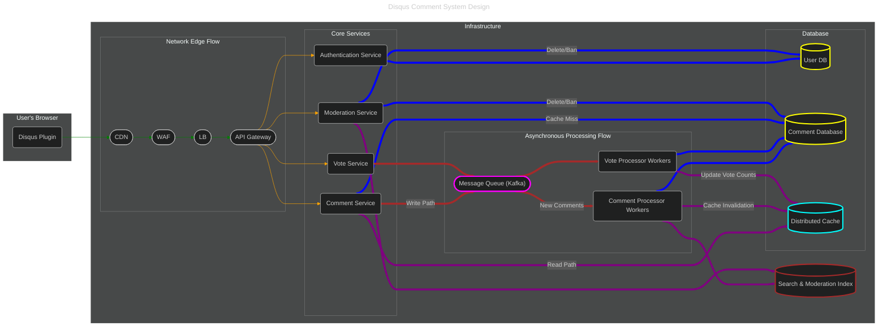

## Introduction
Designing a comment system, such as Disqus, is a feature integrated into websites that allows users to post comments on published content, interact with other users through replies, upvote or downvote comments, and sort or filter comments. This system must be robust, scalable, and efficient to handle a large volume of users and comments..

## Functional Requirements
1. **User Authentication**: Users can create an account, log in, and log out. This requires a secure authentication system that can handle `100M Daily Active Users`.
2. **Comment Submission and Display**: Users can submit comments, which are then stored in a database and displayed under the related content. Assuming each user posts 10 comments every day, and each comment is 100 bytes, the system needs to handle 1 billion comments daily.
3. **Replying to Comments**: Users can reply to other comments, with replies nested under the original comment. This requires a system that can handle complex data relationships.
4. **Upvote or Downvote Comments**: Users can upvote or downvote comments. This requires a system that can track and update the vote count for each comment in real-time. 
5. **Moderation Tools**: Administrators can delete inappropriate comments or ban users. This requires a robust administration system that can handle a large volume of moderation actions.

### Non-Functional Requirements
1. **Scalability**: The system needs to support 100M Daily Active Users and handle 1 billion comments posted daily.
2. **Reliability**: The system must ensure data integrity and error handling.
3. **Availability**: The system must be operational when needed, using techniques like replication to avoid downtime.
4. **Consistency**: Allow for brief inconsistencies in the system within a few seconds, but the system will reach consistency afterwards (eventual consistency).
5. **Latency**: The system must have low latency to provide a smooth user experience.
6. **Efficiency**: The system must minimize redundant operations and optimize resource usage.

## Solution
#### Reference: [Design a Comment System](https://systemdesignschool.io/problems/comment-system/solution)

### High-Level Architecture


### Explanation of Design Considerations
- **Network Edge Flow**: The architecture uses a `Client --> CDN --> WAF --> Load Balancer` flow. This is a modern standard where the CDN acts as the single entry point. It serves static assets from its cache for performance and forwards dynamic API requests through an integrated WAF for security. This provides DDoS protection for all services and simplifies the overall network topology.

- **Decoupling Reads and Writes**:
A key challenge is handling `1 billion comments per day`, which translates to roughly **~11,500 writes per second**. At the same time, the number of users reading comments will be much higher. This creates a classic read-heavy system with a very high write throughput.
  - **Write Path (Asynchronous)**:
    - When a user submits a comment, the request hits the `Comment Service (Write API)`. This service's only job is to validate the request and publish it to a `Message Queue` (like Kafka). 
    - This makes the write operation extremely fast from the user's perspective, satisfying the **low latency** requirement. The API can return a `202 Accepted` response almost instantly.
    - The **Comment Processor Workers** then consume from this queue at their own pace, process the comment, and write it to the primary `Comment Database`. This approach absorbs write spikes and enhances **scalability** and **reliability**.
      
  - **Read Path (Optimized for Speed)**:
    - When a user loads a page, the `Comment Service (Read API)` is called.
    - It first checks a `Distributed Cache` (like Redis). For popular articles, comments will likely be cached, providing a sub-millisecond response time.
    - If there's a cache miss, the service queries the `Comment Database`, loads the comments, populates the cache for subsequent requests, and then returns the data. This "cache-aside" pattern is crucial for performance.

  This separation ensures that a high volume of writes doesn't slow down the reading experience for other users.

- **Choice of Databases**:
No single database is perfect for all tasks. We use different databases optimized for specific needs.
  - **User Database (Relational - e.g., PostgreSQL)**:
    - **Why?** User data (usernames, hashed passwords, email) is relational and requires strong consistency (**ACID** properties). A user's profile information must be accurate. 
    - **Scalability**: We can scale this with primary/replica replication to handle the read load for 100M DAU.
  - **Comment Database (NoSQL - e.g., Cassandra/ScyllaDB)**:
    - **Why?** This database needs to handle massive write throughput and scale horizontally. Wide-column NoSQL databases like Cassandra are built for this. They offer excellent write performance and linear scalability by simply adding more nodes.
    - **Data Model**: We can model the data to optimize for our primary query pattern: _get all comments for a given article ID, sorted by time_. The partition key would be the `article_id`.
    - **Consistency**: These databases are tunable but excel at **eventual consistency**, which is explicitly allowed in your non-functional requirements. This is a perfect fit.
  - **Distributed Cache (In-Memory - e.g., Redis)**:
    - **Why?** To meet the **low latency** requirement for reads. It stores hot data (comments for popular articles, vote counts) in memory for rapid retrieval. It's also used for real-time updates of vote counts, providing a snappy user experience for upvoting/downvoting.
  - **Search & Moderation Index (e.g., Elasticsearch)**:
    - **Why?** For the **Moderation Tools** requirement. Administrators need to search for comments containing specific keywords or by user. Relational or NoSQL databases are not efficient for full-text search. Elasticsearch is purpose-built for this and can handle complex queries with ease. The `Comment Processor` pushes data here after writing to the main database.

- **Scalability and Availability**
  - **Microservices**: The architecture is broken down into small, independent services (`Authentication`, `Comment`, `Vote`, etc.). This allows each service to be scaled independently based on its specific load. For example, if reading comments becomes a bottleneck, we can add more instances of the `Comment Read Service` without touching anything else.
  - **API Gateway**: Acts as the single entry point for routing requests to the appropriate microservices (e.g., `/comments` to Comment Service). It handles cross-cutting concerns like authentication, rate limiting, and service discovery.
  - **Load Balancers**: A dedicated Load Balancer sits in front of the API Gateway to distribute traffic across multiple Gateway instances. It also handles **TLS Termination** (decrypting HTTPS), offloading this CPU-intensive task from the application logic.
  - **CDN (Content Delivery Network)**: Serves the static assets (JavaScript plugin, CSS) from edge locations closer to the user, which dramatically reduces initial load time and improves the user experience, contributing to the **low latency** goal.

- **Security Considerations (WAF)**
  - **Why WAF?** A comment system is a primary target for **Cross-Site Scripting (XSS)** attacks, where malicious users try to inject JavaScript into comments to steal cookies or redirect users. A Web Application Firewall (WAF) sits at the network edge and inspects incoming HTTP requests for malicious payloads (like `<script>` tags) before they reach your servers.
  - **Bot Mitigation**: Comment sections are plagued by spam bots. WAFs often provide rate limiting and bot detection capabilities to block automated spam submissions at the edge, saving your backend resources.
  - **SQL/NoSQL Injection**: It adds an extra layer of defense against injection attacks by filtering out common attack patterns in request parameters.

### Database Schema
A. **PostgreSQL Schema (User & Authentication Data)**: We chose a relational database like PostgreSQL for user data because it requires strong consistency (ACID compliance) and has relational integrity. A user's authentication details or banned status must be accurate and immediately consistent.

**Design Considerations for PostgreSQL:**
- **id BIGSERIAL**: A 64-bit integer is used for the primary key to accommodate more than the 2 billion rows a standard `SERIAL` (32-bit integer) would allow. It's simple and performant for joins.
- **UNIQUE Constraints**: Placing `UNIQUE` constraints on `username` and `email` is essential for the authentication logic and ensures data integrity. PostgreSQL automatically creates indexes on these columns to enforce uniqueness efficiently.
- **password_hash**: We explicitly name this column `password_hash` to make it clear we are storing a secure hash (e.g., from bcrypt) and not the actual password.
- **user_status ENUM**: Using an `ENUM` is more storage-efficient than a VARCHAR and prevents invalid status values from being inserted.
- **Indexes**: In addition to the automatic indexes on the primary key and unique columns, we add an index on `status` to speed up moderation queries (e.g., "list all banned users").

```sql
-- We can define a custom ENUM type for user status for data integrity and efficiency.
CREATE TYPE user_status AS ENUM ('active', 'suspended', 'banned');

-- The main table to store user information.
CREATE TABLE users (
    -- Use BIGSERIAL for an auto-incrementing 64-bit integer, suitable for a large number of users.
    id BIGSERIAL PRIMARY KEY,

    -- A unique username for login and display purposes.
    -- The UNIQUE constraint automatically creates an index for fast lookups.
    username VARCHAR(50) NOT NULL UNIQUE,

    -- User's email, also used for login or notifications. Must be unique.
    email VARCHAR(255) NOT NULL UNIQUE,

    -- Store a secure hash of the user's password, never the plaintext password.
    password_hash VARCHAR(255) NOT NULL,

    -- The user's public display name, which can be different from the username.
    display_name VARCHAR(100),

    -- URL to the user's avatar image.
    avatar_url TEXT,

    -- The current status of the user's account, using our custom ENUM type.
    status user_status NOT NULL DEFAULT 'active',

    -- Timestamps to track when the user account was created and last updated.
    -- TIMESTAMPTZ is used to store timezone-aware timestamps.
    created_at TIMESTAMPTZ NOT NULL DEFAULT NOW(),
    updated_at TIMESTAMPTZ NOT NULL DEFAULT NOW()
);

-- Create an index on the status column for efficient querying of users by their status (e.g., finding all banned users).
CREATE INDEX idx_users_status ON users(status);

-- It's good practice to have a trigger that automatically updates the `updated_at` timestamp.
CREATE OR REPLACE FUNCTION trigger_set_timestamp()
RETURNS TRIGGER AS $$
BEGIN
  NEW.updated_at = NOW();
  RETURN NEW;
END;
$$ LANGUAGE plpgsql;

CREATE TRIGGER set_timestamp
BEFORE UPDATE ON users
FOR EACH ROW
EXECUTE FUNCTION trigger_set_timestamp();
```

B. **Cassandra Schema (Comment & Vote Data)**: For comments, the requirements are massive write throughput and read scalability. A NoSQL database like Apache Cassandra is perfect for this. The key principle in Cassandra is to design your tables based on your queries. We will denormalize data and create multiple tables to serve different read patterns efficiently.

**Design Considerations for Cassandra:**
- **Query-Driven Design**: We have three tables, each serving a specific query pattern. This is standard practice in Cassandra and is the key to its performance at scale.
- **comments_by_article**:
  - _Partition Key (`article_id`)_: This is the most important choice. It ensures that all comments for a single article are co-located on the same server partition, making the query "get all comments for this article" extremely fast as it only requires a single partition read. 
  - _Clustering Keys (`parent_id, comment_id`)_: These keys order the data within a partition. By clustering by `parent_id` first, we can easily query for all top-level comments or all replies to a specific comment. Clustering by `comment_id` (a `timeuuid`) as the second key ensures comments are sorted chronologically by default.
- **Denormalization**: We store `user_display_name` and `user_avatar_url` directly in the `comments_by_article` table. This avoids expensive JOIN operations (which don't exist in Cassandra) when fetching comments to display. The trade-off is that if a user updates their name, we'd need an asynchronous job to update all their comments, but this is acceptable for a read-heavy system.
- **`counter` Type**: Cassandra's `counter` type is specifically designed for atomic, lock-free increment and decrement operations. This is perfect for handling high-frequency upvotes and downvotes without causing contention.
- **user_votes_on_comment**: This table is designed to quickly answer the question: "Has this user already voted on this comment?" The (`user_id`) partition key makes this check very efficient.

```cassandraql
-- First, create a keyspace for our application with a replication strategy.
CREATE KEYSPACE disqus WITH replication = {'class': 'SimpleStrategy', 'replication_factor': 1};

-- Use the newly created keyspace.
USE disqus;

-- Table 1: Optimized for the primary query: "Get all comments for an article".
-- This is the most frequent read pattern.
CREATE TABLE comments_by_article (
    article_id text,          -- The ID of the article/page the comment belongs to. (Partition Key)
    parent_id uuid,           -- The ID of the parent comment (for threading). A zero UUID can represent a top-level comment.
    comment_id timeuuid,      -- A unique, time-based ID for the comment. (Clustering Key)
    user_id bigint,           -- The ID of the user who posted the comment.
    user_display_name text,   -- Denormalized user data for faster reads.
    user_avatar_url text,     -- Denormalized user data for faster reads.
    body text,                -- The content of the comment.
    status text,              -- e.g., 'visible', 'deleted_by_user', 'deleted_by_moderator'
    
    -- The PRIMARY KEY is crucial.
    -- Partition by `article_id` so all comments for one article are on the same node (or replica set).
    -- Cluster by `parent_id` and then `comment_id` to support nested display and sorting.
    PRIMARY KEY ((article_id), parent_id, comment_id)
) WITH CLUSTERING ORDER BY (parent_id ASC, comment_id ASC);

-- 1. Get all comments for an article (Application builds the tree):
SELECT * FROM comments_by_article WHERE article_id = 'A1';
-- 2. Get direct replies to a specific comment (Lazy loading):
SELECT * FROM comments_by_article WHERE article_id = 'A1' AND parent_id = 'C1';
-- 3. Get top-level comments (assuming parent_id is 0000... for root):
SELECT * FROM comments_by_article WHERE article_id = 'A1' AND parent_id = 00000000-0000-0000-0000-000000000000;

-- Table 2: Vote Counts.
-- Cassandra limitation: Counter columns cannot be mixed with non-counter columns in the same table.
-- Why not use standard Integer?
-- 1. "Lost Update" Problem: Concurrent writes (Read-Modify-Write) would overwrite each other without locks.
-- 2. Performance: Using locks (LWT) to prevent lost updates kills throughput. Counters are lock-free.
CREATE TABLE comment_vote_counts (
    comment_id timeuuid PRIMARY KEY,
    upvotes counter,
    downvotes counter
);

-- Get votes for a comment:
SELECT * FROM comment_vote_counts WHERE comment_id = '...';

-- Table 3: Optimized for fetching a single comment directly (e.g., for editing or deleting).
-- This table is a simple key-value lookup. Since comment_id is the Partition Key, queries here are extremely fast (O(1)) because the driver knows exactly which node holds the data.
CREATE TABLE comments_by_id (
    comment_id timeuuid PRIMARY KEY,
    article_id text,
    parent_id uuid,
    user_id bigint,
    body text
    -- We only include the data needed for this specific query to save space.
);

-- Get a specific comment by ID:
SELECT * FROM comments_by_id WHERE comment_id = 50554d6e-29bb-11e5-b345-feff819cdc9f;

-- Table 4: To track which comments a user has voted on to prevent double-voting.
-- This table serves two purposes based on its Primary Key ((user_id), comment_id):
-- 1. Check for existing vote: By providing both the Partition Key (user_id) and Clustering Key (comment_id), we can efficiently check a single row to see if a user has already voted.
-- 2. User Vote History: By providing only the Partition Key (user_id), we can fetch the entire partition, which represents all votes cast by that user.
CREATE TABLE user_votes_on_comment (
    user_id bigint,
    comment_id timeuuid,
    vote_type text, -- 'up' or 'down'
    PRIMARY KEY ((user_id), comment_id)
);

-- 1. Check if a user voted on a specific comment:
SELECT * FROM user_votes_on_comment WHERE user_id = 123 AND comment_id = 50554d6e-29bb-11e5-b345-feff819cdc9f;
-- 2. Get all votes by a user (e.g., for user profile):
SELECT * FROM user_votes_on_comment WHERE user_id = 123;
```
