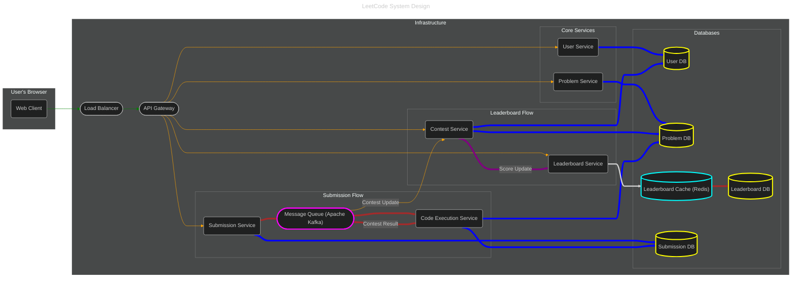

## Introduction
There is a question bank that stores thousands of programming questions. For each question, users can write, compile and submit code against test cases and get results. User submitted code needs to be persisted. Every week, there is a contest where people compete to solve questions as quickly as possible. Users will be ranked based on their accuracy and speed. We’ll need a leaderboard that shows rankings in real time.
> Scope & Scale Estimation
> - `10k users` participating contests concurrently
> - Each user submits solutions `20 times` on average
> - Each submission executes `20 test cases` on average
> - User submitted code have a retention policy of `1 month` after which they will be deleted.
> - Assuming that the storage space required for the solution of each coding question is `10KB`.
> - Assuming that the read:write ratio is `2:1`.

## Functional Requirements
1. **View Problems**: Users should be able to view problem descriptions, examples, constraints, and browse a list of problems.
2. **Submit Solution**: Users should be able to solve coding questions by submitting their solution code and running it against built-in test cases to get results.
3. **Coding Contest**: User can participate in coding contest. The contest is a timed event with a fixed duration of 2 hours consisting of four questions. The score is calculated based on the number of questions solved and the time taken to solve them. The results will be displayed in real time. The leaderboard will show the top 50 users with their usernames and scores.

### Non-Functional Requirements
1. **High Availability**: the website should be accessible 24/7
2. **Low Latency**: during a contest, the leaderboard should be updated in real time
3. **High Scalability**: the website should be able to handle 10k users submitting code concurrently

## Solution
#### Reference: [Design LeetCode](https://systemdesignschool.io/problems/leetcode/solution)

### Understanding the Core Challenges
Based on the requirements, the main challenges are:
1. **Scalable Code Execution**: Running code from thousands of users concurrently in a secure and isolated manner is computationally intensive and a security risk if not handled properly.
2. **Real-time Leaderboard**: Updating and displaying rankings for 10,000 concurrent users with low latency is difficult, especially under heavy write load during a contest.
3. **High Availability & Scalability**: The system needs to be resilient to failures and handle traffic spikes, particularly during contests.

### High-Level Architecture
A microservices architecture is a great fit here. It allows us to scale, develop, and deploy different parts of the system independently.
Here is a high-level diagram of the proposed architecture:


Let's go through the role of each component.
### Component Deep Dive
- Submission Flow (The Core Logic):
This is the most critical part of the system. When a user submits code, we can't just block and wait for it to be judged. That would time out the user's request and overwhelm our web servers. An asynchronous approach is essential.
  1. **Client to Submission Service**: The user submits their code via the API Gateway to the `SubmissionService`.
  2. **Submission Service**:
     - It validates the request (e.g., is the user in the contest? is the problem valid?).
     - It saves the initial submission (code, language, user_id, timestamp) to the `SubmissionDB` with a `PENDING` status.
     - It then pushes a ***judging task*** message into a Message Queue (like RabbitMQ or Apache Kafka).
     - It immediately returns a `submission_id` to the client with a 202 `Accepted` status. The client can now use this ID to poll for the result.
  3. **Message Queue**: This is the key to decoupling our services and handling load. It acts as a buffer. If there's a sudden spike in submissions, they just line up in the queue, and our `CodeExecutionService` can process them at its own pace.
  4. **Code Execution Service ("The Judge")**:
     - This is a pool of worker services that listen for tasks from the Message Queue.
     - When a worker picks up a task, it executes the code in a secure sandbox (e.g., a Docker container) to prevent malicious code from affecting the host system.
     - The worker compiles the code, runs it against each test case (fetched from the `ProblemDB`), and compares the output.
     - After judging, it updates the submission status (`ACCEPTED`, `WRONG_ANSWER`, etc.) and results in the `SubmissionDB`.
     - If the submission was part of a contest, it sends another message back via the queue to notify the `ContestService` to update the score.

- Real-time Leaderboard (Leaderboard Flow):
  Updating a leaderboard with 10k active users is a classic "hot-spot" problem. Using a traditional database would lead to lock contention and slow performance.
  1. **Contest Service**: When a user solves a problem correctly for the first time during a contest, the `ContestService` (after being notified by the Judge) calculates the new score (based on problems solved and penalty time).
  2. **Leaderboard Service**: The `ContestService` then calls the `LeaderboardService` with the `user_id` and their new `score`.
  3. **Redis Sorted Set**: The `LeaderboardService` uses Redis and its `Sorted Set` data structure. A sorted set is perfect for leaderboards because it automatically keeps a collection of unique members sorted by their associated scores.
      - We use the command `ZADD contest:1:leaderboard <score> <user_id>`. Redis handles ordering in O(log N) time, which is extremely fast.
      - To get the top 50 users, we use `ZREVRANGE contest:1:leaderboard 0 49 WITHSCORES`. This is also very fast.

### Design Decisions & Trade-offs:
- ***Why a Message Queue?***
  - **Decoupling & Scalability**: The `SubmissionService` (web-facing) doesn't need to know about the `CodeExecutionService`. We can scale the number of execution workers independently based on the queue length.
  - **Resilience**: If the Judge service goes down, submissions are safely stored in the queue and will be processed once the service is back online.
  - **Trade-off**: It adds a bit of complexity and another component to manage. The latency from submission to result is slightly higher due to queueing, but this is acceptable for a non-blocking operation.
- ***Why Docker for Sandboxing?***
  - **Security & Isolation**: It provides strong process, filesystem, and network isolation, which is critical when running untrusted user code.
  - **Environment Consistency**: We can have pre-built Docker images with all necessary compilers and libraries for each language, ensuring code runs in the same environment every time.
  - **Trade-off**: There's a small overhead for starting a container for each submission. For extreme low-latency requirements, other sandboxing technologies like `gVisor` or `Firecracker` could be considered, but Docker is a robust and well-understood starting point.
- ***Why Redis Sorted Set?***
  - **Performance**: It's an in-memory data structure, making reads and writes incredibly fast, which is exactly what we need for a real-time leaderboard.
  - **Simplicity**: It provides the exact functionality we need out-of-the-box, simplifying our application logic.
  - **Trade-off**: Being in-memory only, data in Redis is not as durable as a disk-based database by default. We can configure persistence (AOF/RDB) to mitigate data loss in case of a crash, but there's a small risk. For a contest leaderboard, this is often an acceptable trade-off for the massive performance gain. The final, official rankings can be calculated and stored in a persistent database after the contest ends.
- ***Caching Pattern Analysis for Adding Database***
  - **Why Write-Through Pattern is best for our Leaderboard**:
    - **Strong Consistency**: Data in the cache and the database are always in sync. When a user gets a new score, the leaderboard is updated in both places at once. Every subsequent read will return the most current data. This eliminates the stale data problem of Cache-Aside.
    - **Durability**: Because writes are confirmed only after they are persisted to the database, we eliminate the risk of data loss that we'd have with Write-Behind. If Redis crashes, the correct data is safe in our database and we can rebuild the cache from it.
    - **Simplicity for Reads**: Read operations are simple and fast, as they always hit the Redis cache, which holds the current, correct data.
    - **Trade-off**: The trade-off is slightly higher write latency, as we have to wait for two writes (Redis and the database). However, for a feature as important as a leaderboard, the guarantees of data consistency and durability are well worth this minor performance cost.
  - ***Problem for Cache-Aside (Lazy Loading)***: The biggest issue here is **stale data**. Imagine a user gets a new high score. With Cache-Aside, we would write the new score to the database. However, the leaderboard data in the cache would be old until it's invalidated (e.g., after a time-to-live or TTL expires). If another user requests the leaderboard before the cache is updated, they will see an outdated version. For a competitive feature like a leaderboard, this inconsistency is a poor user experience.
  - ***Problem for Write-Behind (Write-Back)***: The primary risk is **data loss**. Because the write to the database is asynchronous, if Redis were to crash before it had a chance to persist the new leaderboard data to the database, that data would be lost forever. A user's new high score would vanish. This is too risky for critical data like rankings.

### Database Schema Design
Here's a simplified schema to illustrate the data models.

- Relational Database (PostgreSQL)
We'll use a relational database for data that has strong integrity and relational needs, like users and problems.
```sql
-- /Users/linus/Documents/intelliJWorkspace/OpenSources/SystemDesign/StudyRoom/Case Studies/db_schema.sql

-- Users Table
CREATE TABLE users (
    id BIGSERIAL PRIMARY KEY,
    username VARCHAR(50) UNIQUE NOT NULL,
    email VARCHAR(255) UNIQUE NOT NULL,
    hashed_password VARCHAR(255) NOT NULL,
    created_at TIMESTAMPTZ NOT NULL DEFAULT NOW()
);

-- Problems Table
CREATE TABLE problems (
    id BIGSERIAL PRIMARY KEY,
    title VARCHAR(255) NOT NULL,
    description TEXT NOT NULL,
    difficulty VARCHAR(20) NOT NULL, -- e.g., 'Easy', 'Medium', 'Hard'
    created_at TIMESTAMPTZ NOT NULL DEFAULT NOW()
);

-- Test Cases Table (linked to problems)
CREATE TABLE test_cases (
    id BIGSERIAL PRIMARY KEY,
    problem_id BIGINT NOT NULL REFERENCES problems(id),
    input TEXT NOT NULL,
    expected_output TEXT NOT NULL,
    is_hidden BOOLEAN DEFAULT FALSE
);

-- Contests and Contest Problems
CREATE TABLE contests (
    id BIGSERIAL PRIMARY KEY,
    name VARCHAR(255) NOT NULL,
    start_time TIMESTAMPTZ NOT NULL,
    end_time TIMESTAMPTZ NOT NULL
);

CREATE TABLE contest_problems (
    contest_id BIGINT NOT NULL REFERENCES contests(id),
    problem_id BIGINT NOT NULL REFERENCES problems(id),
    PRIMARY KEY (contest_id, problem_id)
);

-- Leaderboard Table (for persistence)
CREATE TABLE leaderboard_scores (
    contest_id BIGINT NOT NULL REFERENCES contests(id),
    user_id BIGINT NOT NULL REFERENCES users(id),
    score INT NOT NULL,
    submission_time TIMESTAMPTZ NOT NULL,
    PRIMARY KEY (contest_id, user_id)
);
```

- NoSQL Database (Cassandra or similar)
For submissions, we expect a very high write throughput, and the data access pattern is simple (usually by submission_id or user_id + problem_id). A NoSQL database like Cassandra is a good choice.
```sql
-- Cassandra Query Language (CQL) for submissions

CREATE KEYSPACE leetcode WITH replication = {'class': 'SimpleStrategy', 'replication_factor': '1'};

CREATE TABLE submissions (
    id UUID,
    user_id BIGINT,
    problem_id BIGINT,
    contest_id BIGINT,
    code TEXT,
    language VARCHAR,
    status VARCHAR, -- PENDING, RUNNING, ACCEPTED, WRONG_ANSWER, etc.
    execution_time_ms INT,
    execution_memory_kb INT,
    submitted_at TIMESTAMP,
    PRIMARY KEY (id)
);

-- We can create secondary indexes or materialized views for other query patterns
-- For example, to quickly find all submissions by a user for a problem
CREATE INDEX ON submissions (user_id);
CREATE INDEX ON submissions (problem_id);
```

**Design Decisions & Trade-offs:**
- ***Why a mix of SQL and NoSQL? (Polyglot Persistence)***
  - **Best Tool for the Job**: SQL (PostgreSQL) is excellent for the relational data of users, problems, and contests, where data integrity is paramount. NoSQL (Cassandra) excels at handling the massive write volume and simple key-value lookups for submissions.
  - **Scalability**: Cassandra scales horizontally very well, which is what we need for the ever-growing submission data.
  - **Trade-off**: This adds operational complexity. We now have two different database systems to manage, monitor, and maintain.


