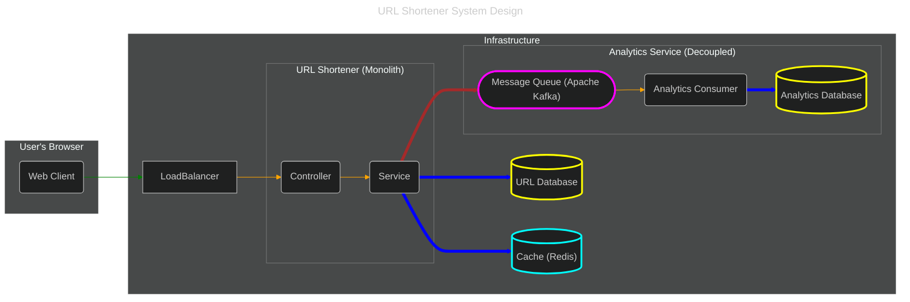
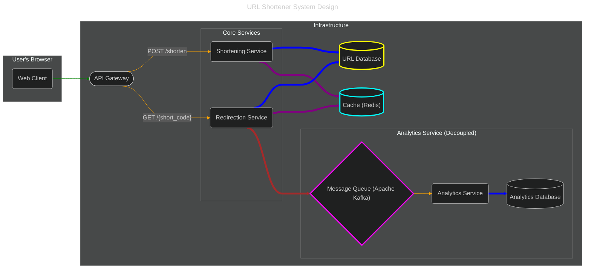

## Introduction
A URL Shortener is a service that takes a long URL and generates a shorter, unique alias that redirects users to the original URL. Popular examples include bit.ly, TinyURL, and Twitter's t.co. This alias is often a fixed-length string of characters. The system should be able to handle millions of URLs, allowing users to create, store, and retrieve shortened URLs efficiently. Each shortened URL needs to be unique and persistent. Additionally, the service should be able to handle high traffic, with shortened URLs redirecting to the original links in near real-time. In some cases, the service may include analytics to track link usage, such as click counts and user locations.
> Scope & Scale Estimation
> - `100M` Daily Active Users
> - Assuming that the Read:write ratio = `100: 1`
> - Assuming that Data retention for 5 years
> - Assuming `1 million` write requests per day
> - Assuming each entry is about `500 bytes`

## Functional Requirements
1. **URL Shortening**: Users should be able to input a long URL and receive a unique, shortened alias. The shortened URL should use a compact format with English letters and digits to save space and ensure uniqueness.
2. **URL Redirection**: When users access a shortened URL, the service should redirect them seamlessly to the original URL with minimal delay.
3. **Link Analytics**: The system should be able to track the number of times each shortened URL is accessed to provide insights into link usage.

### Non-Functional Requirements
1. **High Availability**: The service should ensure that all URLs are accessible 24/7, with minimal downtime, so users can reliably reach their destinations. 
2. **Low Latency**: URL redirections should occur almost instantly, ideally in under a few milliseconds, to provide a seamless experience for users. 
3. **High Durability**: Shortened URLs should be stored reliably so they persist over time, even across server failures, ensuring long-term accessibility.

## Solution
#### Reference: 
- [Design URL Shortener](https://systemdesignschool.io/problems/url-shortener/solution)
- [Design A URL Shortener](https://bytebytego.com/courses/system-design-interview/design-a-url-shortener)

## High-Level Architecture
### Well-Structured Monolith Pattern
It's a common misconception that modern systems must be built with microservices. While microservices are powerful, they introduce significant operational complexity. For this use case, a **well-structured monolith** is a much better fit.

In this pattern, the application is developed and deployed as a single unit (a monolith), but it is internally organized into logical layers (Application, Service, Data). This gives us great separation of concerns and testability without the overhead of a distributed system.

The system scales by running multiple, identical instances of this monolith behind a load balancer, a pattern known as horizontal scaling. The diagram below illustrates the architecture of a single instance.


1. **Application Layer**: This layer is responsible for handling incoming HTTP requests. It will have two main endpoints:
   - `POST /shorten`: This endpoint will take a long URL as input and return a shortened URL. 
   - `GET /{short_url}`: This endpoint will redirect the user to the original URL.
2. **Service Layer**: This layer will contain the business logic for the URL shortening service. It will be responsible for:
   - Generating a unique short URL for each long URL. 
   - Storing the mapping between the short URL and the long URL in a database. Retrieving the long URL for a given short URL
   - Tracking the number of clicks for each short URL.
3. **Data Layer**: This layer will be responsible for storing the data for the URL shortening service. It will consist of a database to store the URL mappings and a cache to store frequently accessed URLs. (Refer to Question for further improvement of Architecture)

### Microservices Architecture
For comparison, here is how one might approach this problem with microservices. While this pattern is powerful for complex systems, it introduces significant drawbacks for this specific use case.


#### Main Concerns with Microservices for This Problem
1. **Shared Kernel / Data Coupling (The Biggest Drawback)**: This is the most significant issue. Both the service that *creates* the short URL and the service that *retrieves* it need to have a deep, shared understanding of the same core data structure: the URL mapping. They will both interact with the exact same database table (`urls`) and the same cache entries.
    - **Problem**: If you decide to change the schema of the `urls` table (e.g., add a new field), you now have to update and redeploy **two separate services** in lockstep. This creates a ***distributed monolith***, where you have the operational overhead of microservices without the key benefit of independent deployability. It violates the core microservice principle of *loose coupling*.
2. **Increased Network Latency**: In the monolith, a call from the API layer to the business logic layer is an instantaneous, in-memory function call. In a microservices architecture, this becomes a network call.
    - **Problem**: For the `POST /shorten` request, the API service would have to make a network call to the *URL Generation Service*. This adds latency to the user's request and introduces another potential point of failure (the network itself). While often small, this overhead is unnecessary for this use case.
3. **Code Duplication**: Both services will need to contain code for things like:
    - Database connection logic and credentials.
    - Cache connection logic.
    - Data Transfer Objects (DTOs) or models representing the URL mapping.
    - **Problem**: This violates the DRY (Don't Repeat Yourself) principle. You can mitigate this by creating shared libraries, but that introduces its own dependency management complexity and can lead back to the "distributed monolith" problem.
4. **Operational Complexity**: Instead of one application to deploy, monitor, and manage, you now have at least two.
    - **Problem**: This means more repositories, more CI/CD pipelines, more dashboards, and more complex debugging. If a request fails, you now have to trace it across multiple service logs to find the root cause. The cost of this complexity is not justified when the services are not truly independent business domains.

## Database Schema Design
### URL Database (PostgreSQL)
This database is optimized for fast reads.
```sql
CREATE TABLE urls (
    id BIGINT PRIMARY KEY AUTO_INCREMENT,
    long_url VARCHAR(2048) NOT NULL,
    short_code VARCHAR(10) NOT NULL,
    created_at DATETIME NOT NULL DEFAULT CURRENT_TIMESTAMP,
    -- Create an index on short_code for fast lookups during redirection
    UNIQUE INDEX idx_short_code (short_code)
);
```
**Table: `urls`**

| Column       | Data Type       | Description                                      |
|--------------|-----------------|--------------------------------------------------|
| `id`         | `BIGINT`        | Primary key                                      |
| `long_url`   | `VARCHAR(2048)` | The original long URL                            |
| `short_code` | `VARCHAR(10)`   | The shortened URL code (indexed)                 |
| `created_at` | `DATETIME`      | The date and time when the short URL was created |

### Analytics Database (Cassandra)
This database is optimized for high-volume writes and analytical queries.
```sql
CREATE KEYSPACE IF NOT EXISTS url_analytics
WITH REPLICATION = { 'class' : 'SimpleStrategy', 'replication_factor' : 3 };

USE url_analytics;

CREATE TABLE clicks (
    -- The short URL code. This is the PARTITION KEY.
    -- All clicks for the same URL will be stored together.
    short_code TEXT,

    -- A unique, time-based identifier for the click event.
    -- This is the CLUSTERING COLUMN. It ensures rows are unique
    -- and sorted by time within the partition.
    click_id TIMEUUID,

    -- Additional metadata for the click.
    user_agent TEXT,
    ip_address INET, -- Cassandra has a native type for IP addresses.

    -- The PRIMARY KEY is composed of the Partition Key and Clustering Columns.
    PRIMARY KEY ((short_code), click_id)
)
-- This clause optimizes for fetching the most recent clicks first.
WITH CLUSTERING ORDER BY (click_id DESC);
```
**Table: `clicks`**

| Column       | Data Type      | Description                      |
|--------------|----------------|----------------------------------|
| `short_code` | `VARCHAR(10)`  | The short code that was accessed |
| `timestamp`  | `DATETIME`     | The time of the click            |
| `user_agent` | `VARCHAR(255)` | Requesting user's agent          |
| `ip_address` | `VARCHAR(45)`  | Requesting user's IP             |


## URL Shorten Mechanism
### Counter with Base-62 Conversion (The Industry Standard)
This is the most common and robust approach. It guarantees uniqueness and is highly performant.
***How it works***:
1. **Use a Global Counter**: The system relies on a single, globally incrementing counter. In our SQL database design, the `urls.id` column (an `AUTO_INCREMENT` primary key) is perfect for this. Every time we insert a new row, the database gives us a new, unique number (e.g., 1, 2, 3, ..., 1,000,000, ...).
2. **Convert the ID to Base-62**: Take that unique integer ID and convert it from Base-10 (decimal) to Base-62.

***Example***:
- Let's say our character set is `0123...abcdef...ABCDEF....`
- A new URL comes in. The database assigns it the unique id = `1000`.
- We convert 1000 to Base-62:
  - `1000 / 62 = 16` with a remainder of 8.
  - `16 / 62 = 0` with a remainder of 16.
- Reading the remainders backward, we get (16)(8).
- Let's say the 8th character in our set is 'h' and the 16th is 'q'.
- The resulting `short_code` is **qh**. (The length will grow as the ID gets bigger).

***Pros***:
- **Guaranteed Uniqueness**: Collisions are impossible because the database's auto-incrementing ID is always unique.
- **Extremely Fast Writes**: The generation is a simple mathematical conversion. There is no need to check the database to see if the code already exists. You `INSERT` the long URL, get the id, convert it, and then `UPDATE` the row with the `short_code`.
- **Scalable**: The length of the short URL grows slowly and predictably. You can generate 56.8 billion unique links before you need to add a 7th character.

***Cons***:
- **Predictable URLs**: The generated URLs are sequential. If your short URL is `abcde`, someone could guess that `abcd` and `abcf` also exist. This can be a security issue if people are shortening private or sensitive links.
- **Centralized Counter**: The auto-incrementing ID relies on a single database (or a single counter service). This can become a write bottleneck at extreme scale. (This is often solved with sharding and offsets, but that's a very advanced topic).
