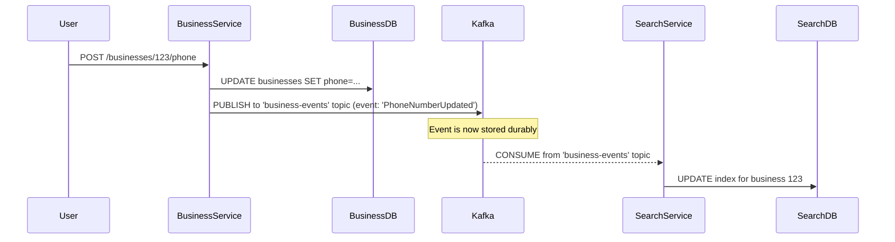
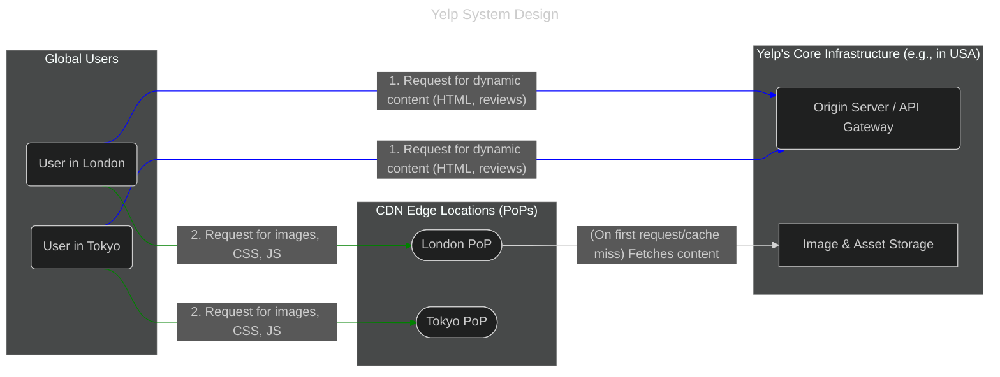

# Yelp

#### Question: In your design, there is only 1 database for all the service to access. But in some other Architectures, qutie often I can see that each service has its own database. Is that a reasonable design? If that is the case, what is the difference between these 2 patterns? What's the consideration behind each of them? Thanks!
That's an excellent question. It touches upon a critical decision in microservices architecture design. You are correct; it is a very common and often recommended pattern for each microservice to have its own dedicated database.
Let's break down the differences between the two patterns: Shared Database vs. Database per Service.

##### Shared Database Pattern:
In this model, multiple services share a single database. This is the simpler approach I initially outlined.

***Considerations & Trade-offs***:
- **Pros**:
  - **Simplicity**: It's easier to set up and manage initially. The development team can leverage familiar `ACID` transactions for data consistency across services.
  - **Easy Data Access**: Joining data across different domains (e.g., getting user details for a review) is as simple as a standard SQL join.
  - **Lower Operational Overhead**: There's only one database to monitor, back up, and manage.

- **Cons**:
  - **Tight Coupling**: This is the most significant drawback. If the `Business Service` team needs to change a table, that change could break the `Review Service` which also uses that table. This violates the principle of service independence and makes it harder to deploy services separately.
  - **Schema Evolution is Difficult**: Coordinating schema changes across multiple teams can become a major bottleneck.
  - **One-Size-Fits-All Technology**: You're locked into a single database technology that may not be the best fit for every service's specific needs.
  - **Performance Bottlenecks**: The shared database can become a single point of contention and a bottleneck for the entire system.

##### Database per Service Pattern:
This is the more idiomatic and scalable pattern for microservices. Each service is the sole owner of its data and is responsible for its own database. No other service can access it directly.

***Considerations & Trade-offs***:
- **Pros**:
  - **Loose Coupling**: Services are truly independent. A service can change its database schema without impacting any other service. This enables independent development, testing, and deployment.
  - **Polyglot Persistence**: Each service can choose the database technology best suited for its needs. For example, the **User Service** might use `PostgreSQL`, while the **Search Service** uses `Elasticsearch`.
  - **Independent Scalability**: Each service's database can be scaled independently based on its specific load, which is much more efficient.
- **Cons**:
  - **Data Consistency**: This is the biggest challenge. Since you can't use a single ACID transaction across multiple databases, you must use other patterns like `event-driven architecture` or the `Saga pattern` to ensure eventual consistency. For example, when a review is created, the `Review Service` might publish a `ReviewCreated` event, and other services can listen to this to update their own local data if needed.
  - **Complex Queries**: You can no longer perform a simple join across services. To get data from multiple services, you must either make multiple API calls and join the data in your application code or use a separate reporting database.
  - **Higher Operational Complexity**: You have more databases to deploy, monitor, and manage, which increases operational overhead.
    Conclusion

##### Conclusion
The **Shared Database** pattern is often a pragmatic choice for the initial stages of a project or when migrating a monolith, as it's simpler to start. However, it introduces tight coupling that undermines the core benefits of microservices.

The **Database per Service** pattern is the ideal for a mature, large-scale microservices architecture like Yelp's would be. It ensures true service autonomy and scalability, but it comes at the cost of increased complexity, especially regarding data consistency.
Thank you for asking this; it's a crucial distinction. The initial design I provided was simplified for clarity, but for a real-world system of Yelp's scale, the **Database per Service** pattern would be the superior choice.

---

#### Question: Could we talk more about Data Synchronization part because I don't quite get that what the scenario it is? And you mention about the event-driven mechanism, I think we can use Apache Kafka which seems very popular in nowadays! Could you also introduce more about this? Thanks!
Let's clarify the data synchronization scenario first, and then we'll see how a tool like Apache Kafka fits in perfectly.

##### The Data Synchronization Scenario: Why is it Needed?
In our Yelp design, we have two distinct services:

1. `Business Service`: This is the **source of truth** for all business information (name, address, phone number, etc.). It uses a relational database (like PostgreSQL) because it needs strong consistency and is great for transactional updates (e.g., creating a new business, updating its hours).
2. `Search Service`: This service's only job is to provide lightning-fast, complex search results. It needs to answer questions like "find all pizza places within a 2-mile radius of me that are open now." A relational database is terrible at this. A specialized search engine like **Elasticsearch** is built for exactly this purpose.

**Here is the problem**: The `Search Service` needs the business data to do its job, but that data lives in the `Business Service`'s private database. How does the data get from the PostgreSQL database into the Elasticsearch index?

This is the ***data synchronization*** problem. The data from the source of truth (`Business Service`) needs to be replicated and transformed into a format suitable for the `Search Service`'s specialized database (Elasticsearch).

##### The Solution: Event-Driven Architecture with Apache Kafka
Instead of having the `Search Service` constantly ask the `Business Service` for changes (which is inefficient), we can flip the model. The `Business Service` can **announce** to the world whenever a change happens. This announcement is called an **event**.

This is where **Apache Kafka** comes in. It acts as a central nervous system or a message bus for all the services.

**What is Kafka?** Kafka is a distributed event streaming platform. Think of it as a highly durable, scalable, and ordered logbook.
- Services can write messages (events) to named logs called **topics**. This is called **producing**.
- Other services can read messages from these topics in the order they were written. This is called **consuming**.

- Crucially, the producer doesn't know or care who is consuming the messages. This decouples the services entirely.

***How it Works in Our Yelp Example***:
Let's walk through a scenario: A restaurant owner updates their phone number.
1. **Update Request**: The owner uses the Yelp app, which sends a request to the `Business Service` to update the phone number for their business.
2. **Update Source of Truth**: The `Business Service` validates the request and updates the business's record in its own private **PostgreSQL** database.
3. **Publish an Event**: Immediately after the database is successfully updated, the `Business Service` produces an event. The event is a small piece of data describing what happened, for example:
   - **Event Type**: `BusinessPhoneNumberUpdated`
   - **Event Data**: `{ "business_id": "123-xyz", "new_phone_number": "555-867-5309" }`
   - It sends this event to a Kafka topic named `business-events`.
4. **Kafka Stores the Event**: Kafka receives this event and appends it to the `business-events` topic log, where it is stored durably.
5. **The Search Service Consumes the Event**: The `Search Service` is a **consumer** of the `business-events` topic. It's always listening for new events. It sees the `BusinessPhoneNumberUpdated` event.
6. **Update Local Data Store**: Upon receiving the event, the `Search Service` knows it needs to update its own data. It finds the document for business "123-xyz" in its **Elasticsearch** index and updates the phone number field.
The next time a user searches for that business, the `Search Service` will have the correct, up-to-date phone number.

##### Visualizing the Flow with a Mermaid Chart

##### Key Benefits of this Approach
- **True Decoupling**: The `Business Service` has no idea the `Search Service` exists. It just publishes events. Tomorrow, you could add a `Notification Service` or an `Analytics Service` that also consumes these events, and the `Business Service` wouldn't need to change at all.
- **Asynchronous & Responsive**: The `Business Service` can publish the event and immediately respond to the user that the update was successful. It doesn't have to wait for the search index to be updated, making the system feel faster.
- **Resilience**: If the `Search Service` goes down for maintenance, the events simply pile up in Kafka. When the service comes back online, it can resume consuming from where it left off and catch up, ensuring no data is lost.
- **Scalability**: Kafka is built to handle massive volumes of events, and you can have many different consumers for the same event stream, allowing your architecture to grow.

---

#### Question: Just to clarify, so now the review retrieval is handled by Search service rathre than Review service, right?
That's an excellent clarifying question, and it gets to the heart of the "separation of concerns" principle in microservices. The short answer is: **No, the `Review Service` is still responsible for retrieving the full list of reviews for a business**.

The responsibility is split based on the user's intent:
1. **Are you finding a business based on review content?** -> `Search Service`
2. **Are you reading the reviews for a specific business?** -> `Review Service`
Let's break that down.

##### Search Service: The Discoverer
The `Search Service`'s job is to handle complex queries to help users discover businesses. It uses review data, but it doesn't serve the reviews themselves. When the `Search Service` consumes a `ReviewCreated` event from Kafka, it doesn't just store the raw review. Instead, it **updates its search index** in a few key ways:
- **It updates aggregate data**: It might recalculate the business's average rating (e.g., from 4.1 to 4.2 stars) and increment the total review count.
- **It indexes the review text**: It adds the text of the review to the business's document in Elasticsearch.

This allows the `Search Service` to answer queries like:
- `GET /search?keyword=pizza&min_rating=4` (Find pizza places with at least a 4-star average rating).
- `GET /search?keyword="great for kids"` (Find businesses where reviews mention "great for kids").
In these cases, the `Search Service`'s response is a list of businesses, not a list of reviews.

##### Review Service: The Source of Truth
The `Review Service` remains the **single source of truth** for review data. Its job is to manage the lifecycle of reviews and provide the canonical, detailed list when requested.
When a user clicks on a specific business to read its reviews, the application will make a call to the `Review Service`'s endpoint:
- `GET /reviews?business_id=123&page=1`

This endpoint is responsible for:
- Fetching the full text, user information, rating, and creation date for each review from its own private database.
- Handling pagination (showing 10 reviews per page).
- Handling sorting (e.g., by newest, oldest, or highest rating).

##### A Typical User Flow
1. **User Searches**: User types "Find tacos with a great patio" into the search bar.
2. **Request to Search Service**: The request hits the `Search Service`. It uses its Elasticsearch index to find businesses whose reviews contain the words "great patio".
3. **Search Service Responds**: It returns a list of *businesses* that match the query.
4. **User Selects a Business**: The user clicks on "Taco Haven" from the list.
5. **Request to Review Service**: The application now needs to display the reviews for "Taco Haven". It makes a *new* API call to `GET /reviews?business_id=taco-haven-id`.
6. **Review Service Responds**: The `Review Service` queries its own database and returns a paginated list of all the reviews for "Taco Haven", which are then displayed to the user.

So, you are right to think that the services interact, but the `Search Service` uses review data to enhance discovery, while the `Review Service` is still the authority for retrieving the actual review content.

---

#### Question:  Now, let's talk about the CDN. What is that and why we need this for this problem?
##### What is a CDN (Content Delivery Network)?
A CDN is a globally distributed network of servers that work together to provide fast delivery of internet content.

Think of it like this: Imagine your main web server (the "origin server") is a large central factory in Virginia, USA. If a customer in Japan wants to buy a product, the request has to travel all the way from Japan to Virginia, and the product has to be shipped all the way back. This is slow.

A CDN is like building a network of local warehouses all over the world (in Tokyo, London, Sydney, etc.). When the customer in Japan wants a product, the request goes to the nearest warehouse in Tokyo. The product is delivered from there, which is much faster. These warehouses are called **Points of Presence (PoPs)**.
The main goal of a CDN is to cache content in these PoPs, which are geographically closer to users, in order to reduce latency.

##### Why Does Yelp Need a CDN?
Yelp's pages are filled with content that is perfect for a CDN. This content is called **static content** because it doesn't change very often. In contrast, **dynamic content** (like the specific list of reviews for a business) is generated on-the-fly and is not suitable for a CDN.

Here are the key types of static content on Yelp that a CDN would handle:
1. **Business Photos**: This is the biggest one. The photos of food, restaurant interiors, salon services, etc., are uploaded once and then viewed thousands or millions of times.
2. **User Profile Pictures**: The pictures of the users who write the reviews.
3. **Site Assets**: The Yelp logo, icons, CSS stylesheets that define the site's look and feel, and JavaScript files that make the site interactive.
Let's walk through a scenario to see the benefit.

***Scenario: A User in London Views a Restaurant Page***
**Without a CDN**:
1. A user in London opens the page for a restaurant in their city.
2. Their browser requests the HTML from Yelp's main server (let's say it's in Virginia, USA).
3. The browser then sees it needs 20 images for the page. It sends **20 separate requests from London all the way to the server in Virginia**.
4. The server in Virginia processes all 20 requests and sends the image data all the way back across the Atlantic to London.
5. **Result**: The page loads slowly because every piece of static content has to travel a huge physical distance. This creates high latency.

**With a CDN**:
1. A user in London opens the page for a restaurant.
2. Their browser requests the HTML from Yelp's main server in Virginia.
3. The browser sees it needs 20 images. The URLs for these images point to the CDN, not the main server.
4. The browser sends **20 separate requests to the CDN**. The CDN automatically routes these requests to the nearest PoP, which is in London.
5. The London PoP already has copies of these images cached. It serves them directly to the user from within the same city.
6. **Result**: The page loads extremely fast because the heaviest content (the images) travels only a few miles instead of thousands.

*(Note: The very first time an image is requested from the London PoP, the PoP won't have it. It will fetch it from the origin server in Virginia, store a copy (cache it), and then serve it to the user. All subsequent requests for that image will be served instantly from the cache.)*

##### Summary of Benefits for Yelp
1. **Lower Latency**: By serving images and assets from a server that is geographically close to the user, pages load much faster, which is critical for user experience and retention. This directly addresses our **Low Latency** non-functional requirement.
2. **Reduced Load on Origin Servers: The ma**in application servers no longer have to waste CPU cycles and bandwidth serving millions of image requests. They can focus on their real job: handling dynamic requests (user logins, searches, posting reviews). This improves **Scalability**.
3. **Lower Bandwidth Costs**: It's often cheaper to serve data from a CDN than from your own origin servers.
4. **Increased Availability**: If your main application server goes down, the CDN can often continue to serve the cached static content, meaning the site might appear broken but will not be completely down.

---
