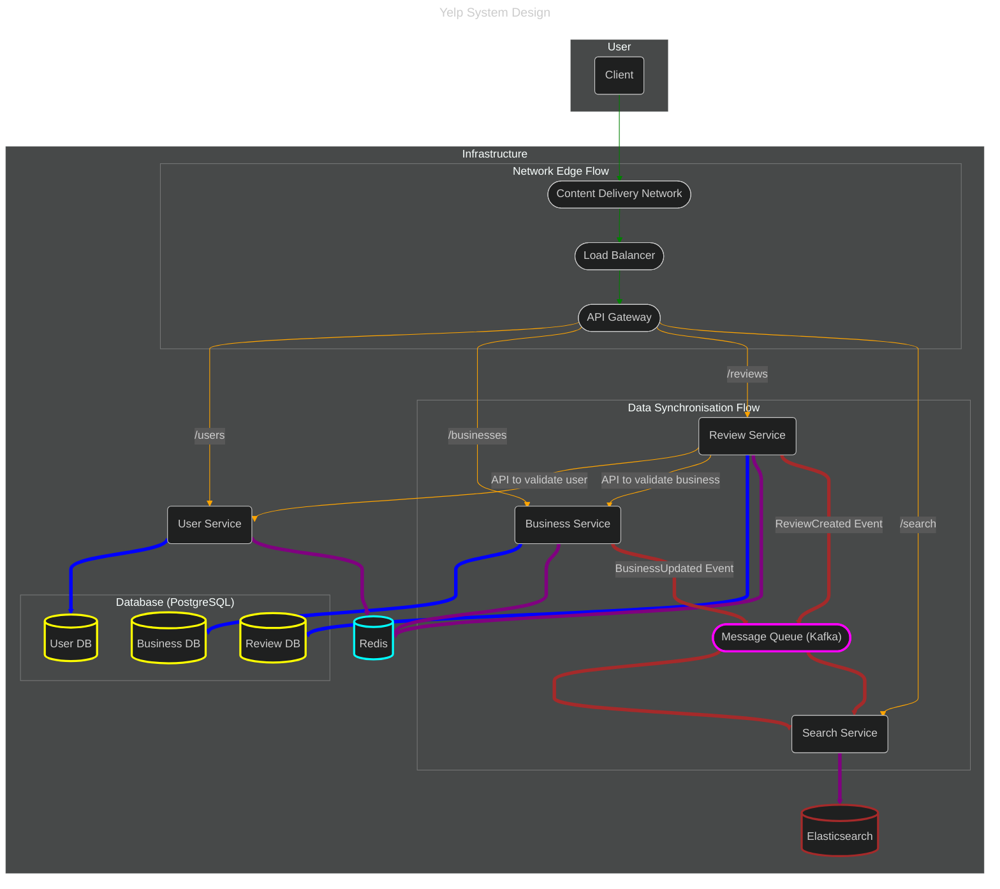

## Introduction
Yelp is a popular online platform that helps users discover and evaluate local businesses. Users can search for nearby restaurants, salons, and other services using geo-based search functionality. The platform allows users to read and write reviews, rate businesses, and access comprehensive business information including contact details, hours of operation, and photos.
> Scope & Scale Estimation
> - `1M` Daily Active Users
> - Assuming that the Read:write ratio = `100: 1`
> - Assuming that Data retention for 5 years
> - Assuming that each user performs 1 write operation per `10 days`.
> - Assuming that each review is `1KB` in size.

## Functional Requirements
1. **Search and view businesses**: User should be able to search for businesses by keyword and location, and view detailed information about a business.
2. **Post a review**: User should be able to post a review for a business.
3. **Get paginated reviews**: User should be able to get paginated reviews for a business.

### Non-Functional Requirements
1. **High Availability**: Implement redundancy and failover strategies to ensure that the system remains operational even in the event of component failures.
2. **Scalability**: The system should be able to scale horizontally to accommodate increasing loads and spikes in user activity without degradation in performance.
3. **Low Latency**: Optimize database queries, use efficient caching mechanisms, and minimize network latency to ensure a fast user experience.

## Solution
#### Reference: [Design Yelp](https://systemdesignschool.io/problems/yelp/solution)

### High-Level Architecture
A microservices-oriented architecture would be a suitable choice for Yelp, as it offers scalability, flexibility, and resilience. This architecture would consist of several independent services, each responsible for a specific business capability.


- **API Gateway**: This serves as the single entry point for all client requests. It routes requests to the appropriate downstream service, and can also handle cross-cutting concerns like authentication, rate limiting, and logging.
- **User Service**: This service would manage user-related operations, such as user registration, login, and profile management.
- **Business Service**: This service would be responsible for managing business information, including details like name, address, and contact information.
- **Review Service**: This service would handle the creation, retrieval, and management of user reviews and ratings for businesses.
- **Search Service**: To provide efficient search capabilities, a dedicated search service would be used. This service would use a search engine like `Elasticsearch` to index business data and provide fast, geo-based search results.

To support these services, the following infrastructure components would be needed:
- **Load Balancers**: To distribute traffic evenly across the services and ensure high availability.
- **Service Discovery**: A mechanism for services to find and communicate with each other.
- **Database**: A combination of SQL and NoSQL databases would be used to store data.
- **Cache**: A distributed cache like Redis would be used to store frequently accessed data and reduce latency.
- **Content Delivery Network (CDN)**: To serve static assets like images and videos quickly to users around the world.

### Database per Service Pattern
1. **Dedicated Databases**: Each service (`User`, `Business`, `Review`, `Search`) now has its own database. This allows each service to choose the best database technology for its needs (e.g., `PostgreSQL` for transactional data, `Elasticsearch` for search).
2. **Service Isolation**: The services are completely decoupled from each other at the data layer. The `Review Service`, for instance, cannot directly access the `User` database.
3. **Communication via APIs**: To get data from another service, a service must make an API call. For example, when creating a review, the `Review Service` would call the `User Service` and `Business Service` to validate the `user_id` and `business_id`.
4. **Data Synchronization**: For patterns like search, the `Search Service` needs data from the `Business Service`. This is handled through a data synchronization process, which could be a direct API call or, more commonly in such architectures, an event-driven mechanism where the `Search Service` subscribes to `BusinessUpdated` events.

### Database Schema
For the database, a combination of SQL and NoSQL databases would be a good fit.

A. **Relational Database (e.g., PostgreSQL)**: A relational database would be used for data that requires strong consistency, such as user and business information.
```sql
-- users Table
CREATE TABLE users (
    user_id INT PRIMARY KEY AUTO_INCREMENT,
    username VARCHAR(255) NOT NULL,
    email VARCHAR(255) UNIQUE NOT NULL,
    password_hash VARCHAR(255) NOT NULL,
    created_at TIMESTAMP DEFAULT CURRENT_TIMESTAMP
);


-- businesses Table
CREATE TABLE businesses (
    business_id INT PRIMARY KEY AUTO_INCREMENT,
    name VARCHAR(255) NOT NULL,
    address VARCHAR(255),
    city VARCHAR(255),
    state VARCHAR(255),
    zip_code VARCHAR(10),
    latitude DECIMAL(9,6),
    longitude DECIMAL(9,6),
    phone_number VARCHAR(20),
    website VARCHAR(255),
    created_at TIMESTAMP DEFAULT CURRENT_TIMESTAMP
);

-- reviews Table
CREATE TABLE reviews (
    review_id INT PRIMARY KEY AUTO_INCREMENT,
    user_id INT,
    business_id INT,
    rating INT CHECK (rating >= 1 AND rating <= 5),
    review_text TEXT,
    created_at TIMESTAMP DEFAULT CURRENT_TIMESTAMP,
    FOREIGN KEY (user_id) REFERENCES users(user_id),
    FOREIGN KEY (business_id) REFERENCES businesses(business_id)
);
```

B. **NoSQL Database (e.g., Elasticsearch)**: For the search functionality, a NoSQL database like Elasticsearch would be used to store a denormalized version of the business data. This would allow for fast and efficient full-text and geospatial searches.
