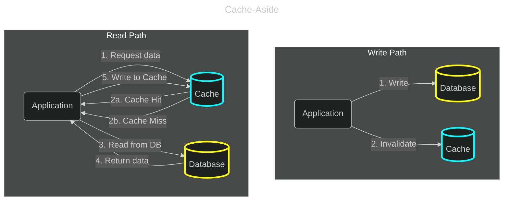
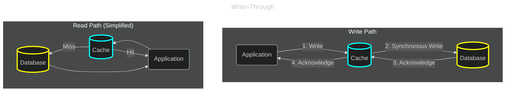
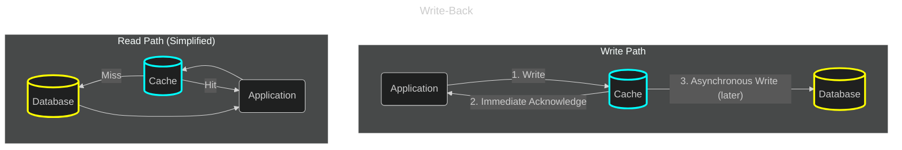

# Cache
## Reference:
- [Redis: Getting Started](https://redis.io/learn/howtos/quick-start)
- [How to use Redis for Write-behind Caching](https://redis.io/learn/howtos/solutions/caching-architecture/write-behind)
- [How to use Redis for Write-through Caching strategy](https://redis.io/learn/howtos/solutions/caching-architecture/write-through)

## Cache Mechanism & Design Decision
Should we always consider Cache as a part of the architecture gets to the heart of a key trade-off in system design? It's true that caching is discussed in almost every system design interview and is a cornerstone of most large-scale applications. The short answer is: You should always consider a cache, but you should not always implement one. Think of a cache not as a mandatory component, but as a powerful tool to solve specific problems. An experienced engineer knows not just how to use the tool, but, more importantly, when and why to use it.

### Why is Caching so Popular? The "Pros"
You add a cache to your system to solve one or more of these core problems:
1. **Improve Performance (Reduce Latency)**: This is the most common reason. Reading data from an in-memory cache like Redis is orders of magnitude faster than reading from a disk-based database (even one with SSDs). For example in LeetCode system, fetching a problem description or the current leaderboard from a cache will feel instantaneous to the user, whereas hitting the database every time could introduce noticeable lag under load.
2. **Reduce Load on Backend Systems**: Every request served from the cache is one less request your database has to handle. This is crucial for scalability. During a contest, thousands of users might be viewing the same few problems. Serving those problem descriptions from a cache prevents the database from being overwhelmed by thousands of identical `SELECT` queries, allowing it to dedicate its resources to more critical tasks.
3. **Increase Availability**: If the primary database has a temporary failure or becomes slow, a cache can continue to serve data, allowing parts of your application to remain functional in a degraded state. This is a form of fault tolerance.
4. **Save Costs**: In cloud environments, database operations and provisioned throughput can be expensive. By reducing the number of database reads, a cache can directly lower your operational costs.

### The Hidden Costs of Caching: The "Cons"
This is the part that is often overlooked. A cache is not free; it introduces its own set of challenges.
1. **Increased System Complexity**: A cache is another piece of infrastructure you have to deploy, manage, monitor, and secure. You now have two sources of data, which complicates your application logic.
2. **Data Consistency Issues (The Hardest Problem)**: This is the biggest trade-off. When data is updated in your primary database, how do you ensure the cache is also updated or invalidated?
    - If you don't invalidate the cache, users will see **stale data**.
    - Implementing a robust cache invalidation strategy can be very difficult. The below strategies (Cache-Aside, Write-Through, Write-Back) each come with their own trade-offs in terms of performance, consistency, and complexity.
3. **Potential for New Failure Modes**: What happens if your cache server goes down? Does your entire application fail? You need to build your application to be resilient to cache failures, for example, by gracefully falling back to the database (which could then get overwhelmed, a "thundering herd" problem).

### A Mental Framework: When to Reach for the "Cache" Tool
So, how do you decide? Ask yourself these questions:
1. **Is my data read-heavy?**
    - **YES**: If data is read far more often than it's written (e.g., a problem description, a user's profile, a configuration setting), it's a prime candidate for caching.
    - **NO**: If data is written as often as it's read, the overhead of keeping the cache consistent might negate the performance gains.
2. **Is it acceptable to serve slightly stale data?**
    - **YES**: For many use cases (like problem descriptions or even the leaderboard which updates every few seconds), serving data that is a few seconds or minutes old is perfectly fine. This makes caching much easier (you can just use a Time-To-Live (TTL)).
    - **NO**: For systems that require absolute, up-to-the-millisecond consistency (like a bank balance or a stock trade), caching is much trickier and might not be appropriate for reads.
3. **Is the data expensive to compute or fetch?**
    - **YES**: If generating a piece of data requires complex database joins, multiple service calls, or heavy computation, you should absolutely cache the result. Don't do the same hard work over and over again.
    - **NO**: If the data is a simple key-value lookup in an indexed database table, the performance gain from caching might be minimal, especially at low traffic levels.

### Conclusion: Start Simple, Add When Needed
For a new system, the best practice is often to **build it without a cache first**.

Focus on a clean design and a well-indexed database. Once the system is running, use monitoring and profiling tools to identify the actual performance bottlenecks. Is a specific database query too slow? Is a particular service getting too much traffic?

When you have **data-driven evidence** of a performance problem, then you can strategically apply caching to solve that specific issue. This approach prevents "premature optimization" and keeps your system as simple as possible for as long as possible.

---

## Caching Architecture
### 1. Cache-Aside (Lazy Loading)
This is the most common caching strategy and likely the one you'll implement most often. The application code is responsible for managing the cache.

- **How it works:**
    - **Write Path**:
        1. The application writes the data directly to the database.
        2. The application then issues a command to invalidate (delete) the corresponding entry in the cache.
    - **Read Path**:
        1. The application tries to read data from the cache.
        2. **Cache Hit**: If the data is in the cache, it's returned to the application.
        3. **Cache Miss**: If the data is not in the cache, the application reads it from the database, writes it into the cache for next time, and then returns it.

- **Pros**:
    - **Resilience**: If the cache fails, the system can still function (albeit more slowly) because the application can always fall back to reading from the database.
    - **Lazy Loading**: The cache is only populated with data that is actually requested. This prevents the cache from being filled with "cold" data that is never used, making it memory-efficient.
    - **Simple Data Model**: The data model in the cache and the database can be different, as the application logic handles the mapping.

- **Cons**:
    - **Cache Miss Penalty**: Every cache miss results in three operations: a cache read, a database read, and a cache write. This makes the first request for a piece of data noticeably slower.
    - **Potential for Stale Data**: There is a small window between the database write and the cache invalidation where the cache holds stale data. If a read occurs during this window, it will get the old data.
    - **`Thundering Herd` Problem**: If a very popular item expires from the cache, multiple requests might miss the cache at the same time and all rush to hit the database, potentially overwhelming it.

- **Best For**:
    - **Read-heavy workloads** where the data doesn't change extremely frequently.
    - Situations where **minor data staleness is acceptable**.
    - **Use Case in LeetCode Design**: Caching problem descriptions. A problem description is read thousands of times but is rarely updated. It's perfectly fine if an update takes a few seconds to propagate.

### 2.Write-Through
In this pattern, the cache is the main point of interaction for writes. The cache itself takes responsibility for writing the data to the database.

- **How it works**:
    - **Write Path**:
        1. The application writes the data to the cache.
        2. The cache **synchronously** writes the same data to the database.
        3. The operation is only considered complete after the data is successfully written to both the cache and the database.
    - **Read Path**: ***Same as Cache-Aside***. The application checks the cache first, and on a miss, it reads from the database and populates the cache.

- **Pros**:
    - **Strong Data Consistency**: Data in the cache is never stale. A read immediately following a write will always return the correct, new data.
    - **Simpler Application Logic**: The application only needs to interact with the cache for writes, offloading the database write logic.

- **Cons**:
    - **Higher Write Latency**: The write operation is only complete after writing to both the cache and the database. This makes the write operation slower than Cache-Aside, as it's subject to the latency of both systems.
    - **Cache is Not a "Sidecar**": The cache is now a critical part of the write path. If the cache fails, writes will fail. This reduces the overall system availability compared to Cache-Aside.
    - **Wasted Writes**: Data that is written but never read again still incurs the cost of being written to the cache, potentially evicting more useful data.

- **Best For**:
    - Applications that require **strong consistency** and cannot tolerate stale data.
    - Workloads where the data is read very frequently right after being written.
    - **Use Case in LeetCode Design**: This pattern is less common but could be used for something like a user's account settings. When a user changes their username, they expect to see it updated everywhere immediately. The slightly higher write latency is an acceptable trade-off for the guaranteed consistency.

### 3. Write-Back (or Write-Behind)
This pattern is designed for maximum write performance. Like Write-Through, the application writes to the cache, but the database update happens asynchronously.

- **How it works**:
    - **Write Path**:
        1. The application writes the data to the cache.
        2. The cache immediately acknowledges the write to the application.
        3. The cache then asynchronously writes the data to the database in the background, often in batches or after a short delay.
    - **Read Path (Simplified)**: ***Same as Cache-Aside***.

- **Pros**:
    - **Extremely Low Write Latency**: The application experiences very fast writes because it only has to wait for the in-memory cache write to complete.
    - **Reduced Database Load**: The cache can batch multiple writes into a single database operation, significantly reducing the write load on the database and improving its overall performance.
    - **Resilience to DB Downtime**: The application can continue to accept writes even if the database is temporarily unavailable (as long as the cache is up and has capacity).

- **Cons**:
    - **Risk of Data Loss**: This is the biggest drawback. If the cache fails or the server crashes before the data has been "flushed" to the database, those writes are permanently lost. This makes it unsuitable for critical data.
    - **Increased Complexity**: The implementation is more complex. You need a reliable mechanism to manage the write-back queue and handle failures during the asynchronous write process.
    - **Eventual Consistency**: There is a period where the cache and the database are out of sync, which can be problematic if other systems read directly from the database.

- **Best For**:
    - **Write-heavy workloads** where top-tier write performance is the primary goal.
    - Applications that can tolerate a small amount of data loss in a worst-case scenario.
    - **Use Case in LeetCode Design**: A good example could be tracking the number of times a problem has been attempted. It's a very high-volume write operation, but losing a few counts in a rare server crash is not a critical failure. The cache could aggregate counts in memory and write them to the database every few seconds.

### Summary
In practice:
- The application always detects and handles cache misses.
- The cache system (like `Redis`) doesn’t query the DB automatically unless it is integrated with a **Read-Through** proxy layer.
- Some managed cache systems (e.g. AWS ElasticCache with Redis or Memcached) can act as a **Read-Through** cache, meaning:
  - The cache itself can call a “loader function” on miss.
  - That abstracts away the cache-aside logic from the application.

---

## Discussion
### Question: I've heard that even in Write-Through pattern, it can still experience a cache miss. What is the scenario and why is that?
🔍 Why Cache Misses Still Occur in Write-Through
- 🧩 Scenario 1: Cache Eviction (TTL or Memory Limit)
    Even in write-through:
    - The cache can evict entries due to:
    - TTL (time-to-live) expiration, or 
    - Memory pressure / LRU policy in Redis.

    So, even if writes always go through the cache, the cached value might have been evicted before the next read.
    Example:
    - App writes user u1 → cache & DB both updated. 
    - Redis evicts user:u1 key after TTL expiry or memory limit. 
    - Next read → cache miss → cache must fetch from DB again.

    🧠 Takeaway: Write-through doesn’t prevent eviction or expiry — it only ensures writes go to both cache and DB.

- 🧩 Scenario 2: Cache Cold Start or Restart
    When a new Redis instance is started (e.g., after restart or cluster scaling), its cache is empty.

    Even though your write logic uses write-through:
    - Existing data already in DB wasn’t written via cache (historical data).
    - Cache needs to “warm up” via reads or preloading.

    Result: The first time an existing key is requested, you’ll hit a cache miss.

- 🧩 Scenario 3: Partial Key Coverage
    If your application writes only certain entities via the write-through path, but other data was:
    - Seeded directly in DB, or 
    - Modified by other systems (e.g., ETL job, admin panel)

    Then that data won’t yet exist in the cache — leading again to a miss when first read.

- 🧩 Scenario 4: Distributed Cache Synchronization Lag
    If you use multiple cache nodes or replicas, it’s possible that:
    - A write hits node A.
    - A read hits node B that hasn’t yet synchronized (if replication lag or async updates).

    Result: a temporary cache miss (or stale read).

### Question: So in those cache miss scenarios, how application can get latest data back? Does the application have to handle this itself?
Let’s unpack it carefully: When a cache miss occurs (even under Write-Through), who is responsible for getting the data back into cache and keeping it fresh?
- **Handling**: The read path still looks like Cache-Aside for misses:
  - Application reads from cache.
  - If miss → application queries the database.
  - After getting fresh data, it writes to cache (and optionally DB if needed — though DB is usually already up-to-date).
- **Why Not Automatic?**: Redis (or similar caches) typically don’t have direct access to your DB schema or query logic — so the application must decide how to reload the data and what format to store it in cache.

So in practice:
    - The application always detects and handles cache misses.
    - The cache system (like Redis) doesn’t query your DB automatically unless you integrate a “read-through” proxy layer (rare in Redis setups).

- **Optional Optimization - `Read-Through Proxy`**: Some managed cache systems (e.g. `AWS ElastiCache` with Redis or Memcached, or custom middlewares) can act as a **read-through cache**, meaning:
  - The cache itself can call a “loader function” on miss.
  - That abstracts away the cache-aside logic from the application.

But in plain Redis, this doesn’t exist out of the box — it’s your app’s job.
