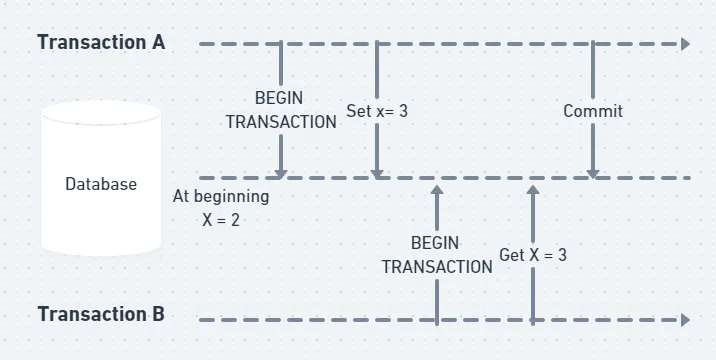
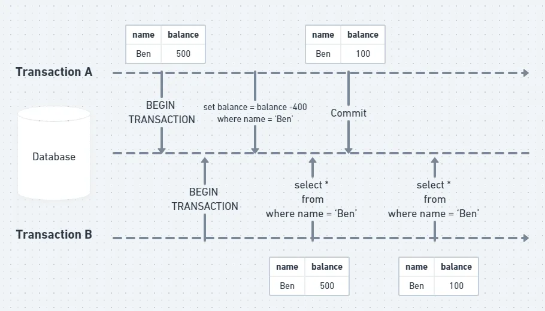
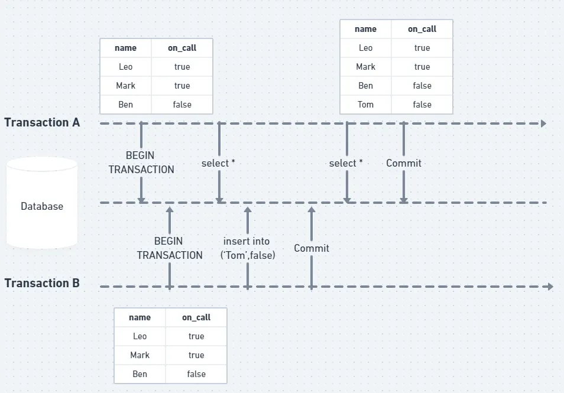
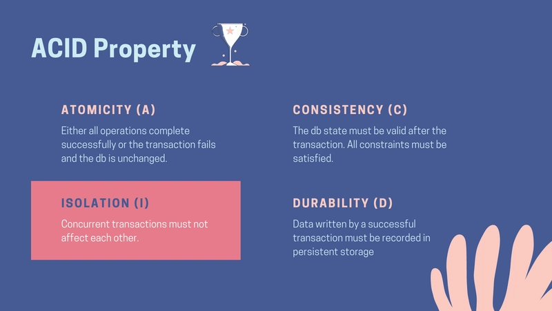

# Database

## Reference
- [PostgreSQL 17.5 Documentation](https://www.postgresql.org/docs/17/index.html)
- [UUIDs are Bad for Performance in MySQL - Is Postgres better? Let us Discuss](https://www.youtube.com/watch?v=Y5mWz4vK10A)
- [MySQL UUIDs – Bad For Performance](https://www.percona.com/blog/uuids-are-popular-but-bad-for-performance-lets-discuss/)
- [Choosing a Database for Systems Design](https://www.youtube.com/watch?v=6GebEqt6Ynk)

## Foundation
### ACID (Atomicity, Consistency, Isolation, & Durability)

### Naming Convention
Database naming conventions are a subject of many debates, but `strong`, `consistent` conventions are a hallmark of a professional and maintainable project. The short answer is: **Consistency is the most important rule**. Whatever you choose, apply it everywhere.
However, there is a widely adopted set of *best practices* that has become the de facto standard in modern application development. I'll outline that for you and explain the reasoning.

#### The Recommended Convention
Here is the most common and recommended approach:

| Element         | Convention             | Example                                |
|:----------------|:-----------------------|:---------------------------------------|
| Tables          | Plural, snake_case     | urls, user_profiles, clicks            |
| Columns         | Singular, snake_case   | long_url, created_at, user_agent       |
| Primary Key     | Always just id         | id                                     |
| Foreign Key     | singular_table_name_id | url_id, user_profile_id                |
| All Identifiers | lowercase              | urls, long_url (never URLs or longUrl) |
| SQL Keywords    | UPPERCASE              | SELECT, FROM, CREATE TABLE, WHERE      |

1. **Tables: Plural vs. Singular**
   - **Recommendation**: **Plural** (`urls`)
   - **Reasoning**: This is the most intuitive approach. A table holds a *collection* of records. You `SELECT` from `urls` to get one or more URLs. It reads like plain English: *Get all records from urls where the id is 5*. This convention is heavily favored by most modern web frameworks (like Ruby on Rails, Django, and Laravel), so following it makes integration with those tools seamless.
2. **Word Separator: snake_case vs. camelCase**
   - **Recommendation**: `snake_case` (`user_agent`)
   - **Reasoning**: This is arguably the most critical convention to follow.
     - **Case-Insensitivity**: Many SQL databases (like PostgreSQL) will fold unquoted identifiers to lowercase by default. If you name a column `userAgent` (`camelCase`), a query like `SELECT userAgent FROM ...` might fail because the database sees it as `select useragent from ....` To make it work reliably, you'd have to quote it everywhere: `SELECT "userAgent" FROM ....` This is tedious, error-prone, and universally considered a bad practice.
     - **Readability**: `snake_case` is the traditional and most readable format within the SQL ecosystem. It also contrasts nicely with `UPPERCASE` SQL keywords.
3. **Casing: lowercase vs. UPPERCASE**
   - **Recommendation**: `lowercase` for identifiers, `UPPERCASE` for keywords.
   - **Reasoning**:
     - Using `lowercase` for table and column names completely avoids the case-sensitivity issues mentioned above. It's the safest, most portable convention.
     - Using `UPPERCASE` for SQL keywords (`SELECT`, `FROM`, etc.) provides excellent visual separation between the logic of your query and the schema identifiers. It makes queries significantly easier to read at a glance.
    
   ```sql
    /* Good */
    SELECT long_url, short_code FROM urls WHERE id = 123;
   
    /* Bad (Hard to read) */
    select long_url, short_code from urls where id = 123;
   ```

### Read Phenomena
- **Dirty Reads**: A transaction reads data **that has been modified by another transaction but has not yet been committed**. If the other transaction rolls back, the reading transaction ends up with an inconsistent view of the data.
  
- **Non-repeatable Reads**: A transaction reads the same row multiple times and **gets different results** because another transaction modified (updated or deleted) that row **(and committed)** in between the reads.
  
- **Phantom Reads**: A transaction re-executes a query and finds new rows that were not there initially, because another transaction inserted or deleted rows that match the query conditions.
  
- **Lost Update**: 

### Isolation Level
Reference: [Deeply understand Isolation levels and Read phenomena in MySQL & PostgreSQL](https://dev.to/techschoolguru/understand-isolation-levels-read-phenomena-in-mysql-postgres-c2e) 
Isolation is one of the four property of a database transaction, where at its highest level, a perfect isolation ensures that all concurrent transactions will not affect each other.


- **Read Uncommitted**:
- **Read Committed**:
- **Repeatable Read**:
- **Serializable**:


## Index
Reference: [Use The Index, Luke!](https://use-the-index-luke.com/)

Primary Key vs. Primary Index

### B-Tree & B+Tree
Reference: 
- [索引結構演化論 B+樹](https://ithelp.ithome.com.tw/articles/10221111)
- [MySQL 的索引實現](https://ithelp.ithome.com.tw/articles/10221572)

### Hash Index

### LSM Tree + SSTable
- [LSM Trees: the Go-To Data Structure for Databases, Search Engines, and More](https://medium.com/@dwivedi.ankit21/lsm-trees-the-go-to-data-structure-for-databases-search-engines-and-more-c3a48fa469d2)
- [Log Structured Merge Tree Definition](https://www.scylladb.com/glossary/log-structured-merge-tree/)
- Really fast to write, i.e. just write to memory layer first (memtable) but slow to read, i.e. have to read from multiple SSTable

### Q & A
- What is the difference between a primary key and an index key
> A primary key is a special kind of index in that:
>  - there can be only one;
>  - it cannot be nullable; and
>  - it must be unique.
     > It's usually to use the primary key as the **most natural unique identifier** for a row (such as social security number and employee ID, although there is a school of thought that one should always use an `artificial surrogate` key for this).
     > Indexes, on the other hand, it's mainly used for **fast retrieval** based on specified columns.

## Database Type
- **Relational Database Management System (*RDBMS*)**:
  - Relational databases represent and store data in tables and rows that one can perform join operations using SQL across different database tables.
  - Choose SQL database when:
    - Correctness (**ACID**) is the most important factor of the application
    - There are a lot of relations between entities
    - e.g. Banking, Job Scheduling applications
- **Non-Relational Databases (*NoSQL*)**:
  - These databases are grouped into four categories: `Key-Value`, `Document`, `Column`, and, `Graph` stores.
  - Choose NoSQL database when:
    - Your application requires **super-low latency**. 
    - Your data are unstructured, or you do not have any relational data. 
    - You only need to **serialize** and **deserialize data** (JSON, XML, YAML, etc.). 
    - You need to store a **massive amount of data**.

### NoSQL Choices
#### MongoDB
- **Document** Data Model
- **B-Tree** index & **Transaction** supported
> Rarely make sense to use in System Design Interview because nothing is `special` about this.
> But it's good for requirement of SQL like guarantees on data with more flexibilities.

#### Apache Cassandra
- **Wide Column** Data Model
- **Peer to Peer** architecture: can write to any node so good for write
- **LSM Tree** index: Really fast write
> Great for applications with write high volume and consistency is not the first priority.
> e.g. Chat Application

- Implementation
  - [DS201.17 Write Path | Foundations of Apache Cassandra](https://www.youtube.com/watch?v=mDd4I-isodE)
  - [DS201.18 Read Path | Foundations of Apache Cassandra](https://www.youtube.com/watch?v=x6g0sUi-5tw)
  - [DS201.19 Compaction | Foundations of Apache Cassandra](https://www.youtube.com/watch?v=69sHSF0iUqg)


#### Apache HBase
- **Wide Column** Data Model
- **Single Leader** replication
- **LSM Tree** index: Really fast write
- Column Oriented Storage
> Great for applications that needs fast column read


## Database Internals
### Hash Tables Chaining vs.Probing (Open-Addressed)
- [Hash table](https://en.wikipedia.org/wiki/Hash_table)
- [Why do we use linear probing in hash tables when there is separate chaining linked with lists?](https://stackoverflow.com/questions/23821764/why-do-we-use-linear-probing-in-hash-tables-when-there-is-separate-chaining-link)

> Chaining and open-addressing (a simple implementation of which is based on linear-probing) are used in Hashtables to resolve collisions. A collision happens whenever the hash function for two different keys points to the same location to store the value. 
> In order to store both values, with different keys that would have been stored in the same location, chaining and open-addressing take different approaches: while chaining resolves the conflict by created a linked list of values with the same hash; 
> open-addressing tries to attempt to find a different location to store the values with the same hash. The main difference that arises is in the speed of retrieving the value being hashed under different conditions. 
> 
> Let's start with [chaining](https://en.wikipedia.org/wiki/Hash_table#/media/File:Hash_table_5_0_1_1_1_1_1_LL.svg) as collision resolution.
> A chained hash table indexes into an array of pointers to the heads of linked lists. Each linked list cell has the key for which it was allocated and the value which was inserted for that key.
> When you want to look up a particular element from its key, the key's hash is used to work out which linked list to follow, and then that particular list is traversed to find the element that you're after.
> If more than one key in the hash table has the same hash, then you'll have linked lists with more than one element. Notice that after calculating the hash function, you need to get the first element from the list to get the value required.
> Therefore, you access the pointer to the head of the list and then the value: 2 operations. The downside of chained hashing is having to follow pointers in order to search linked lists.
> The upside is that chained hash tables only get linearly slower as the load factor (the ratio of elements in the hash table to the length of the bucket array) increases, even if it rises above 1.
>
> On the other hand, with [open-addressing](https://en.wikipedia.org/wiki/Hash_table#/media/File:Hash_table_5_0_1_1_1_1_0_SP.svg), a hash table indexes into an array of pointers to pairs of (key, value).
> You use the key's hash value to work out which slot in the array to look at first. If more than one key in the hash table has the same hash, then you use some scheme to decide on another slot to look in instead.
> For example, linear probing is where you look at the next slot after the one chosen, and then the next slot after that, and so on until you either find a slot that matches the key you're looking for, or you hit an empty slot (in which case the key must not be there).
> Open-addressing is usually faster than chained hashing when the load factor is low because you don't have to follow pointers between list nodes.
> However, when your HashTable starts to get full, and you have a high load factor, due to collisions happening more often, probing will require you to check more Hashtable locations before you find the actual value that you want.
> Also, you can never have more elements in the hash table than there are entries in the bucket array
> 
> At about a load factor of 0.8, chaining starts to become more efficient due to multiple collisions: you would have to probe a lot of empty cells in order to find the actual value you want with probing, 
> while with chaining you have a list of values that have the same hash key. To deal with the fact that all hash tables at least get slower (and in some cases actually break completely) when their load factor approaches 1, 
> practical hash table implementations make the bucket array larger (by allocating a new bucket array, and copying elements from the old one into the new one, then freeing the old one) when the load factor gets above a certain value (typically about 0.7).
> This is just a quick overview, as the actual data, the distribution of the keys, the hash function used and the precise implementation of collision resolution will make a difference in your actual speed.

### Concurrency Control Mechanisms
- [Chapter 13. Concurrency Control](https://www.postgresql.org/docs/current/mvcc.html)
#### Predicate Lock
- [Predicate Locking](https://www.tutorialspoint.com/predicate-locking)
> A predicate lock in a database system is a lock that reserves not just a single row from being changed by other transactions, 
> but all rows that satisfy a particular condition (or predicate). These locks are usually placed with a SELECT FOR UPDATE statement.

#### Materialising Conflicts

## Cache
### Cache Strategies
- [淺談各種資料庫cache策略: cache aside、read through、write through、write back](https://homuchen.com/posts/databse-chache-strategies/)


