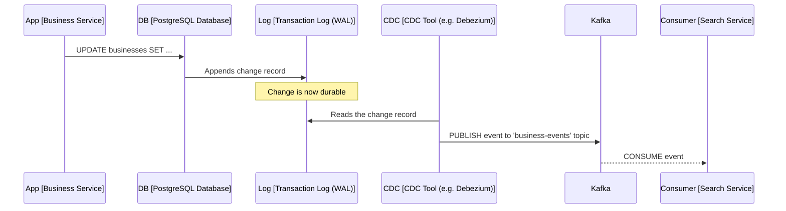

# Event-Driven Architecture

## What is Apache Kafka & CDC
The most important thing to understand is: **CDC and Kafka are not competitors; they are partners**. They solve two different problems that, when combined, create an incredibly robust system.

Let's use an analogy:
- **CDC (Change Data Capture)** is like a court reporter who sits in a courtroom and writes down everything that happens, word for word, as it happens.
- **Apache Kafka** is like the printing press and distribution network that takes the reporter's transcript, prints thousands of copies, and delivers them reliably to every subscriber in the city.
  Now, let's dive into the technical details.

### What is CDC (Change Data Capture)?
**CDC is a pattern or a technique, not a specific tool**. It's a process for automatically capturing row-level changes (`INSERT`, `UPDATE`, `DELETE`) made to a database and making those changes available as a stream of events.

The key insight of modern CDC is that it **does not query the database**. Instead, it reads the database's internal **transaction log** (also known as a write-ahead log or WAL).
- In PostgreSQL, this is the `Write-Ahead Log (WAL)`.
- In MySQL, this is the `binlog`.
- In Oracle, this is the `Redo Log`.

Every time you write to the database, a record of that change is first appended to this log to ensure durability. CDC tools tap into this log, read the changes in real-time, and convert them into structured events.

***Benefits of CDC***:
1. **Low Latency**: It captures changes almost instantly.
2. **No Impact on Source Database**: It doesn't add any load to the database itself, as it's just reading a log file.
3. **Reliable & Complete**: It captures every change, even if the change was made by a DBA manually or through a different application. It guarantees you won't miss anything.

### What is the Difference and How Do They Work Together?
This is the crucial part. CDC is the source of the change events, and Kafka is the transport for them. Let's revisit our Yelp architecture and compare two ways of generating events.

***Approach 1: The Application-Level "Dual Write" (What we discussed before)***
1. The `Business Service` receives a request to update a business's phone number.
2. **Step A**: The service's code writes the change to its PostgreSQL database.
3. **Step B**: The service's code then explicitly creates a `BusinessUpdated` event and publishes it to Kafka.

**The Problem (The "Dual Write" Problem)**: What happens if Step A succeeds, but Step B fails (e.g., a network blip, Kafka is temporarily down)? The database is updated, but the event is never sent. The `Search Service` never finds out about the change, and the data is now **inconsistent**. This is a major issue.

***Approach 2: The CDC Pattern (The Better Way)***
1. **The Business Service** receives a request to update a business's phone number.
2. The service's code writes the change to its PostgreSQL database. **That's it. Its job is done.**
3. A dedicated **CDC tool** (like `Debezium`, which is designed to work with Kafka) is monitoring the PostgreSQL transaction log (the WAL).
4. The CDC tool sees the `UPDATE` statement in the log. It automatically formats this change into a structured event.
5. The CDC tool then publishes this event to a Kafka topic.
6. This completely solves the **dual write** problem. The database transaction is the single source of truth. If the change is committed to the database, it will be in the transaction log, and therefore it will be captured and sent to Kafka.

### Visualizing the CDC Flow


### Summary Table
| Feature      | CDC (Change Data Capture)                                          | Apache Kafka                                                              |
|:-------------|:-------------------------------------------------------------------|:--------------------------------------------------------------------------|
| What is it?  | A pattern or technique for capturing database changes.             | A platform or tool for streaming events.                                  |
| Primary Role | To source or originate event data from a database.                 | To transport, store, and distribute event data.                           |
| How it Works | Reads the database's internal transaction log (e.g., WAL, binlog). | Manages topics where producers write events and consumers read them.      |
| Analogy      | The court reporter.                                                | The newspaper printing press and delivery network.                        |
| Relationship | CDC produces events that are published to Kafka.                   | Kafka consumes events from CDC tools and delivers them to other services. |

In short, you use a CDC tool *to get data into Kafka* in the most reliable way possible, removing that responsibility from your application code and making your entire system more robust and less complex.

---

## What is Apache Kafka and Apache Flink
Apache Kafka and Apache Flink are often used together to build real-time data processing pipelines. 
Kafka serves as the event streaming platform, where it collects, stores, and distributes streams of data (events), while Flink is the stream processing engine that consumes and processes these data streams in real-time. 
Here’s a detailed look at how Kafka works with Flink and how they integrate to provide real-time processing capabilities.

## How Kafka Works with Flink
1. Kafka as a Data Source for Flink
   Flink can consume data from Kafka topics using a Kafka Source connector. This means Flink subscribes to Kafka topics and continuously receives events as they are published to Kafka. 
   Flink can handle both streaming and batch data from Kafka, depending on the nature of the application.

	Basic Flow:
	1. ka Producers generate events and publish them to Kafka topics. 
	2. Kafka Brokers manage the published topics and partition the data for scalability. 
	3. Flink jobs use a Kafka Source connector to subscribe to specific Kafka topics and start consuming data for real-time processing.

2. Processing Data in Flink 
   Flink processes the Kafka data stream in a variety of ways. Some common processing techniques include:
   - Filtering: Flink can filter out unnecessary events from the Kafka stream based on specific criteria.
   - Transformation: Flink can transform the Kafka events, for example by parsing JSON data, aggregating events, or enriching them with additional data.
   - Windowing: Flink can group events based on time windows (e.g., processing events that arrive within a 10-second window).
   - Stateful Processing: Flink’s stateful computation allows it to maintain state across events, which is critical for tasks like counting, event correlation, or pattern detection over time.

3. Kafka as a Sink for Flink 
    After processing the data, Flink can send the results back to Kafka using a Kafka Sink connector. The processed data can be written to one or more Kafka topics, where other services or applications can consume it for further processing, storage, or analytics.

    Basic Flow:
    1. Flink Jobs process the data stream from Kafka.
    2. Kafka Sink in Flink writes the processed data to specific Kafka topics.
    3. Kafka Consumers (such as databases, analytics engines, or dashboards) read the processed data from Kafka topics.

4. Fault Tolerance and Exactly-Once Semantics 
   Kafka and Flink can work together to ensure fault tolerance and exactly-once processing. Flink’s checkpointing mechanism ensures that if a failure occurs during the processing, the system can recover and continue processing from the last known checkpoint without missing or duplicating data.
   - Kafka Offsets: Kafka assigns an offset to each message (event) in a topic partition. Flink keeps track of the offsets it has consumed and processes them in order. When Flink checkpoints its progress, it stores the Kafka offsets as part of the checkpoint, ensuring that it can resume processing from the correct position in the Kafka stream in case of failure. 
   - Exactly-Once Semantics: By combining Kafka’s ability to retain events and Flink’s checkpointing and state management, Flink can guarantee exactly-once processing, meaning each event is processed exactly once, even in the case of failures or retries.

5. Event Time Processing
   Flink supports event time processing, which means it can process events based on the time they were generated (not just the time they were received). This is important when processing delayed events or handling out-of-order events in real-time streams.
   - Timestamps: Kafka events typically contain timestamps indicating when the event occurred. Flink can use these timestamps to perform windowing operations or time-based aggregations. 
   - Watermarks: Flink uses watermarks to handle out-of-order events. Watermarks are special markers in the data stream that signal when all events up to a certain timestamp have been processed, allowing Flink to advance event time and handle late-arriving data appropriately.

6. Kafka and Flink in Streaming Architectures
   In modern real-time architectures, Kafka and Flink often serve complementary roles:
   - Kafka as the “Data Backbone”: Kafka serves as the central event bus, collecting data from various producers (e.g., IoT sensors, applications, or logs) and making it available for consumers like Flink. 
   - Flink as the “Real-Time Processor”: Flink consumes the raw event streams from Kafka, performs real-time processing (filtering, aggregation, enrichment), and sends the processed results to different sinks (e.g., databases, dashboards, or other Kafka topics).

Typical Kafka + Flink Architecture
1. Kafka Producers generate data and push it into Kafka topics.
2. Flink Jobs read from these Kafka topics, process the events in real-time, and optionally store intermediate state (e.g., aggregations) in Flink’s state backend. 
3. Kafka Sink is used to push the processed data back into Kafka, where other systems or applications can consume it for further action, storage, or analysis.
4. External Sinks: Flink can also write the final results to external systems like databases, message queues, or cloud storage.

### Step-by-Step Setup for Kafka and Flink Integration
- Step 1: Set Up Apache Kafka
	1. Install and Start Kafka:
        • Install Kafka and Zookeeper on your machine or use a managed Kafka service (e.g., Confluent Cloud).
        • Start Zookeeper and Kafka brokers.
    2. Create Kafka Topics:
        • Create the Kafka topics that Flink will consume from and write to:

```bash
kafka-topics.sh --create --topic input-topic --bootstrap-server localhost:9092 --partitions 3 --replication-factor 1
kafka-topics.sh --create --topic output-topic --bootstrap-server localhost:9092 --partitions 3 --replication-factor 1
```

Step 2: Set Up Apache Flink

	1.	Install Flink:
	•	Download and install Flink on your machine or set up a Flink cluster.
	2.	Write a Flink Job:
	•	Create a Flink job that reads data from Kafka, processes it, and writes the results back to Kafka.
Example Flink job in Java (or Scala, Python):
```java
// Import Kafka connector and Flink API
import org.apache.flink.streaming.api.environment.StreamExecutionEnvironment;
import org.apache.flink.streaming.connectors.kafka.FlinkKafkaConsumer;
import org.apache.flink.streaming.connectors.kafka.FlinkKafkaProducer;
import org.apache.flink.streaming.util.serialization.SimpleStringSchema;

public class KafkaFlinkExample {
    public static void main(String[] args) throws Exception {
        final StreamExecutionEnvironment env = StreamExecutionEnvironment.getExecutionEnvironment();

        // Kafka Source: Reading from Kafka topic "input-topic"
        FlinkKafkaConsumer<String> kafkaSource = new FlinkKafkaConsumer<>(
                "input-topic",
                new SimpleStringSchema(),
                kafkaProperties);

        // Define your Flink processing logic here
        DataStream<String> processedStream = env.addSource(kafkaSource)
                .map(value -> "Processed: " + value);

        // Kafka Sink: Writing to Kafka topic "output-topic"
        FlinkKafkaProducer<String> kafkaSink = new FlinkKafkaProducer<>(
                "output-topic",
                new SimpleStringSchema(),
                kafkaProperties);

        processedStream.addSink(kafkaSink);

        // Execute the Flink job
        env.execute("Kafka-Flink Integration Example");
    }
}
```

Step 3: Run the Flink Job

	1.	Submit the Job to Flink:
	•	Submit your Flink job to a Flink cluster or run it locally.
```bash
./bin/flink run -c KafkaFlinkExample target/KafkaFlinkExample.jar
```

	2.	Monitor the Job:
	•	You can monitor Flink jobs using the Flink web dashboard to see metrics like throughput, task status, and latency.

Benefits of Using Kafka with Flink

	1.	Real-Time Stream Processing: Flink processes Kafka streams with low latency, enabling real-time analytics and event-driven applications.
	2.	Scalability: Kafka’s distributed nature allows Flink to scale by consuming data from multiple partitions of Kafka topics in parallel.
	3.	Fault Tolerance: Both Kafka and Flink have built-in fault tolerance mechanisms. Kafka’s durability ensures that data is never lost, and Flink’s state management and checkpointing ensure that processing resumes correctly after failures.
	4.	Event Time and Exactly-Once Guarantees: Flink’s ability to handle event time and out-of-order events, combined with its exactly-once processing guarantees, makes it ideal for building reliable real-time systems.

Conclusion

Apache Kafka and Apache Flink form a powerful combination for building real-time streaming applications. Kafka provides a scalable, fault-tolerant event streaming platform, while Flink offers real-time processing, state management, and exactly-once semantics. Together, they enable sophisticated real-time data pipelines, event-driven architectures, and real-time analytics applications.