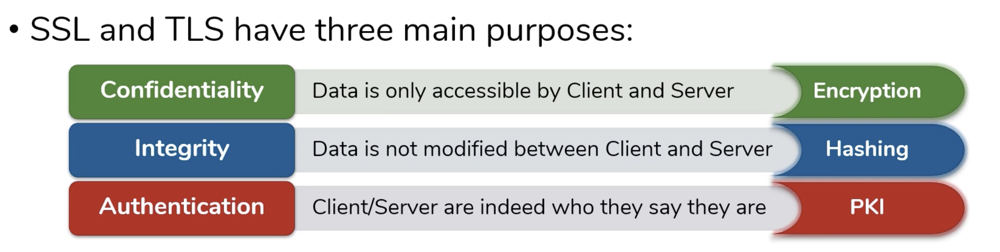
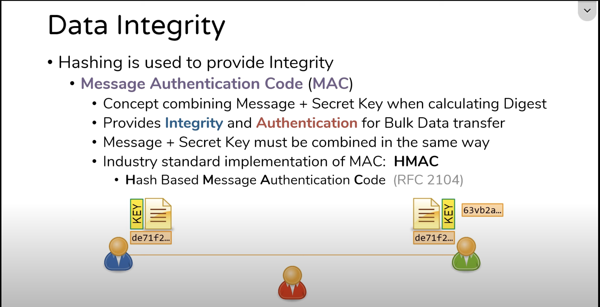
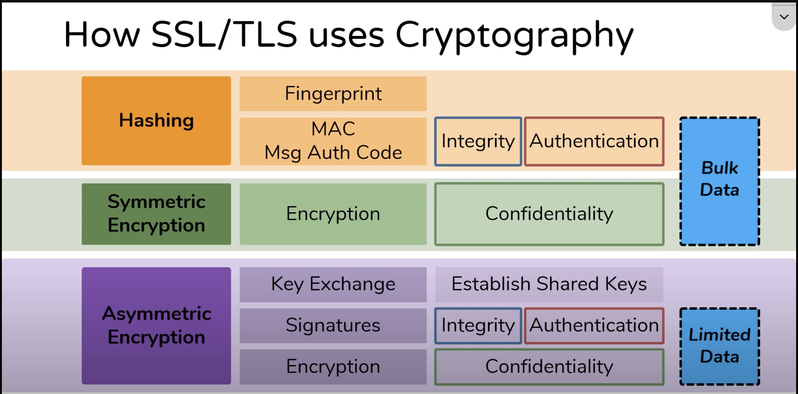
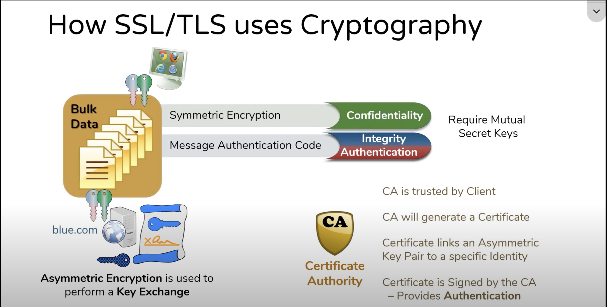

# SSL

## Reference:
### SSL/TLS & Cryptography
- [Practical TLS](https://www.youtube.com/playlist?list=PLIFyRwBY_4bTwRX__Zn4-letrtpSj1mzY)
- [RSA, Diffie-Hellman, DSA: the pillars of asymmetric cryptography](https://www.practicalnetworking.net/practical-tls/rsa-diffie-hellman-dsa-asymmetric-cryptography-explained/)

### Diffie-Hellman Key Exchange
- [Diffie-Hellman Key Exchange: How to Share a Secret](https://www.youtube.com/watch?v=85oMrKd8afY)
- [Secret Key Exchange (Diffie-Hellman) - Computerphile](https://www.youtube.com/watch?v=NmM9HA2MQGI)
- [Diffie-Hellman -the Mathematics bit- Computerphile](https://www.youtube.com/watch?v=Yjrfm_oRO0w)
- [Key Exchange Problems - Computerphile](https://www.youtube.com/watch?v=vsXMMT2CqqE)
- [Elliptic Curves - Computerphile](https://www.youtube.com/watch?v=NF1pwjL9-DE)

### Other
- [Public Key Cryptography - Computerphile](https://www.youtube.com/watch?v=GSIDS_lvRv4)
- [What Is a PFX Certificate File and How Do You Create It?](https://codesigningstore.com/what-is-a-pfx-certificate-file-and-how-do-you-create-it)
- [Develop Locally with HTTPS, Self-Signed Certificates and ASP.NET Core](https://www.humankode.com/asp-net-core/develop-locally-with-https-self-signed-certificates-and-asp-net-core/)

## SSL / TSL
References:
- [What is SSL & TLS ? What is HTTPS ? What is an SSL VPN?](https://www.youtube.com/watch?v=HMoFvRK4HUo)
- [Key Players of SSL & TLS: Client, Server, Certificate Authority (CA)](https://www.youtube.com/watch?v=C7Y4UEBJ0Og)
- [Practical TLS - TLS / SSL - The complete sequence](https://www.youtube.com/watch?v=LJDsdSh1CYM)
- [TLS / SSL Versions - Part 1](https://www.youtube.com/watch?v=_KgZNF8nQvE)
- [TLS / SSL Versions - Part 2](https://www.youtube.com/watch?v=fk0-UqwVNqY)

```markdown
Both `SSL (Secure Sockets Layer)` and `TLS (Transport Layer Security)` are cryptographic protocols designed to:
- Secure communication over a computer network (like the Internet)
- Provide confidentiality, integrity, and authentication for data transferred between two endpoints (e.g., browser ↔️ server)
They operate on top of TCP and below application protocols like HTTP, SMTP, or FTP.
```

### Cryptography Purposes
[How do SSL & TLS protect your Data? - Confidentiality, Integrity, Authentication](https://www.youtube.com/watch?v=WfR3ZAP96mQ)


### Data Integrity
[Data Integrity - How Hashing is used to ensure data isn't modified - HMAC - Cryptography](https://www.youtube.com/watch?v=doN3lzzNEIM)


### Cryptography Components & PKI
- [How SSL & TLS use Cryptographic tools to secure your data](https://www.youtube.com/watch?v=aCDgFH1i2B0)


- [Public Key Infrastructure](https://www.youtube.com/watch?v=Jefr7wFLu3M)


### Symmetric Encryption vs Asymmetric Encryption
[Encryption - Symmetric Encryption vs Asymmetric Encryption - Cryptography](https://www.youtube.com/watch?v=o_g-M7UBqI8)


## Certification
### Certification Mechanism
Every time users visit an HTTPS site, their browser downloads the site’s certificate, containing a public key of the server that the site is hosted on, signed with a private key of the Certificate Authority (CA). The operating system (OS) comes with a list of trusted root CA’s which are pre-installed. Browsers use these list of root CA’s to validate the certificate against. This is done by verifying that the public key in the certificate that your browser downloaded from the site is signed by the CA that issued that certificate. The certificate also contains the domain name of the server and is used by your browser to confirm that site that the browser is connected to is the same as the site listed in the certificate issued by the CA.

Since we don’t use certificates issued by CA’s for local development, we can issue a self-signed certificate and then add this self-signed certificate to our trusted root certificate authority store.
This way, the browser will trust the certificate.

### What is a PFX certificate?
- A PFX certificate, or PKCS#12 certificate, is a digital file that contains three main components: the public certificate, the private key, and any necessary intermediate certificates. The public certificate is used to verify the identity of the certificate holder, 
- While the private key is used to encrypt and decrypt data. Intermediate certificates provide a chain of trust from the certificate to a trusted root certificate.

- Creating a PFX certificate involves several steps:
  1. Generating a Certificate Signing Request (CSR): The process begins with creating a CSR, a file containing your public key and identity information, which is sent to a Certificate Authority (CA). 
  2. Obtaining the Certificate: Once the CA validates the CSR, it issues a digital certificate. 
  3. Combining Components: The final step involves using tools like OpenSSL to combine the certificate, private key, and any intermediate certificates into a PFX file. This process ensures that all necessary components are included in a single, manageable file.

- Extract .key and .crt files from .pfx file
```shell
# Extract Private Key
openssl pkcs12 -in [xxx.pfx] -nocerts -out [name.key]
# Extract Certificate
openssl pkcs12 -in [xxx.pfx] -clcerts -nokeys -out [name.crt]

# Decode Certificate
openssl x509 -in [name.crt] -text -noout
```

### Certification on Linux (RHEL 9)
Reference:
- [UPDATE-CA-TRUST - Manual](https://www.linux.org/docs/man8/update-ca-trust.html)
- [Using shared system certificates](https://docs.redhat.com/en/documentation/red_hat_enterprise_linux/9/html/securing_networks/using-shared-system-certificates_securing-networks#using-shared-system-certificates_securing-networks)
- [How to Add, Remove, and Update CA Certificates in Linux - Red Hat Distributions](https://www.baeldung.com/linux/ca-certificate-management#2-red-hat-distributions)
- [Extracting Certificate Information with OpenSSL](https://www.baeldung.com/linux/openssl-extract-certificate-info)

In RHEL, the consolidated system-wide truststore is located in the `/etc/pki/ca-trust/` and `/usr/share/pki/ca-trust-source/` directories.
The trust settings in `/usr/share/pki/ca-trust-source/` are processed with **lower priority** than settings in `/etc/pki/ca-trust/`.
Certificate files are treated depending on the subdirectory they are installed to:
- Trust anchors belong to
    - `/usr/share/pki/ca-trust-source/anchors/`
    - `/etc/pki/ca-trust/source/anchors/`

- Distrusted certificates are stored in 
    - `/usr/share/pki/ca-trust-source/blocklist/`
    - `/etc/pki/ca-trust/source/blocklist/`

- Certificates in the extended BEGIN TRUSTED file format are located in 
    - `/usr/share/pki/ca-trust-source/`
    - `/etc/pki/ca-trust/source/`

### Adding New Certificate
Reference: [Using shared system certificates - Adding new certificates](https://docs.redhat.com/en/documentation/red_hat_enterprise_linux/9/html/securing_networks/using-shared-system-certificates_securing-networks#the-system-wide-trust-store_using-shared-system-certificates)

1. To add a certificate in the simple PEM or DER file formats to the list of CAs trusted on the system, copy the certificate file to the `/usr/share/pki/ca-trust-source/anchors/` or 
`/etc/pki/ca-trust/source/anchors/` directory, for example:
```shell
cp ~/[MyCertificate.crt] /etc/pki/ca-trust-source/anchors/
```
2. To update the system-wide trust store configuration, use the update-ca-trust command:
```shell
update-ca-trust extract
```

### ca-bundle.crt v.s. ca-bundle.trust.crt
Reference: [Difference between ca-bundle.crt and ca-bundle.trust.crt](https://serverfault.com/questions/620003/difference-between-ca-bundle-crt-and-ca-bundle-trust-crt)

`ca-bundle.trust.crt` holds certs with "extended validation". The difference between "normal" certs and certs with EV is that you EV certs need something like a personal or company validation by i.e. validating the identity of a person by his/her passport. This means that if you want to get an EV cert you'll have to identify yourself to the cert issuer by i.e. your passport. If you "are" a company then an equivalent procedure (don't know it exactly) must happen. This is most essential for online banking: You must be sure that not only the server you connect to is certified but also the bank is certified. Because of that the EV certs are more "complicated" and contain additional fields to "identify" not only the server but also the company. Depending on the usage. Most people should use `ca-bundle.crt`. If you "are" a bank or an online shop which needs very high level of certification and "trust" then you should use `ca-bundle.trust.crt`.


