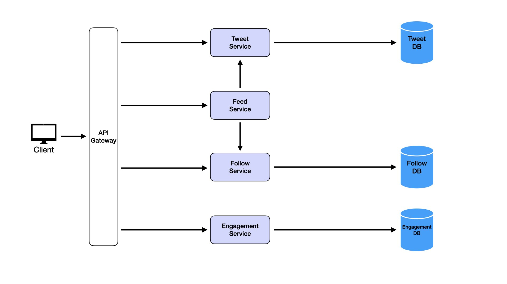
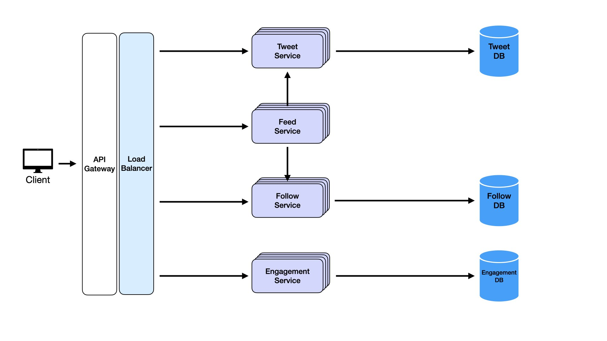
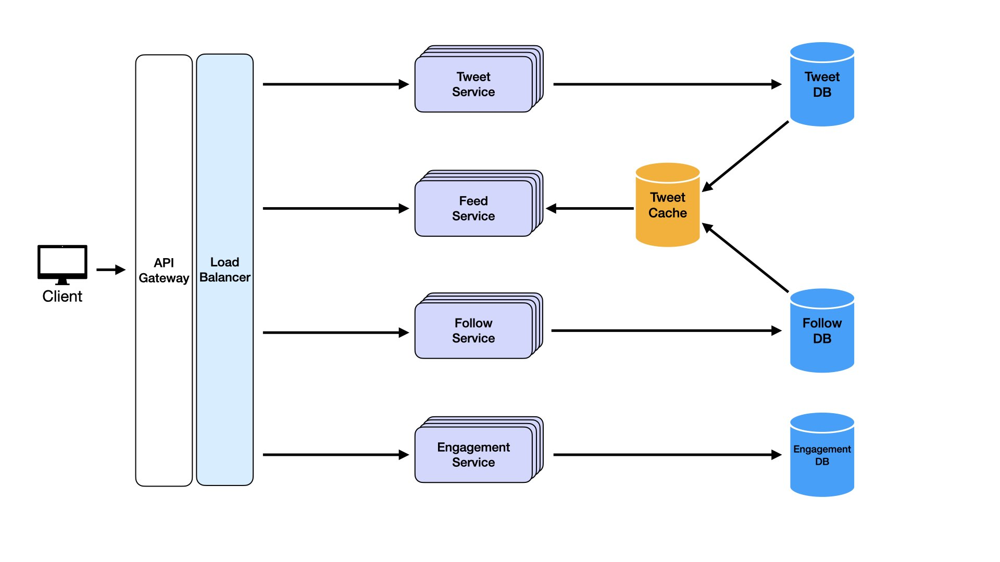
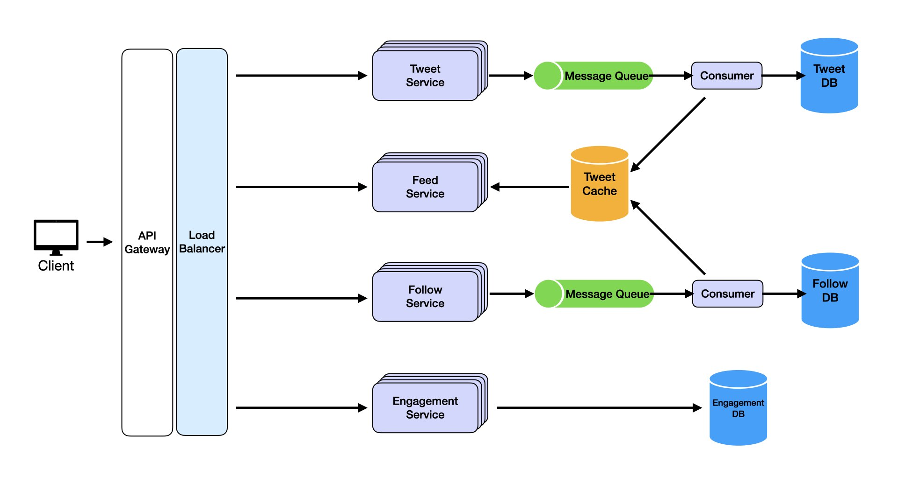
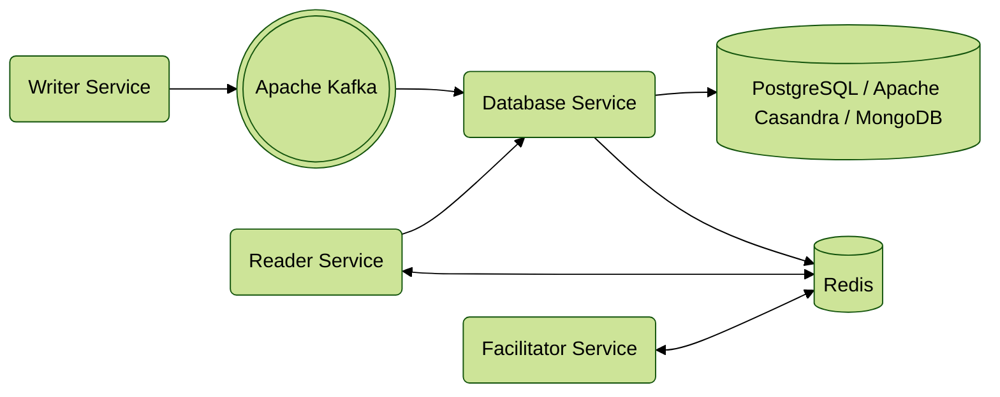
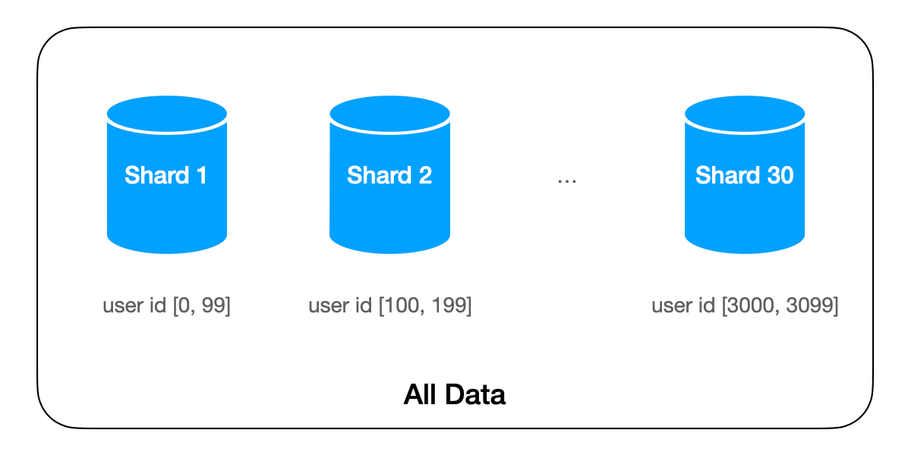
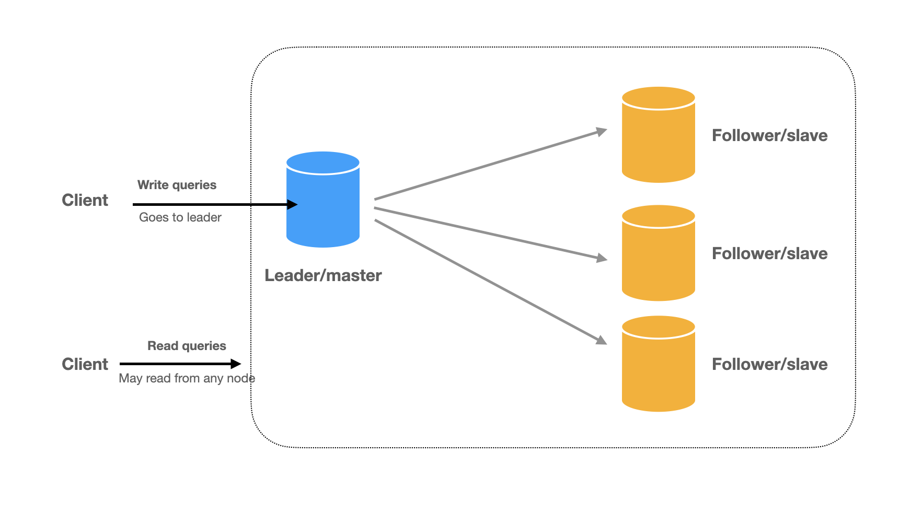
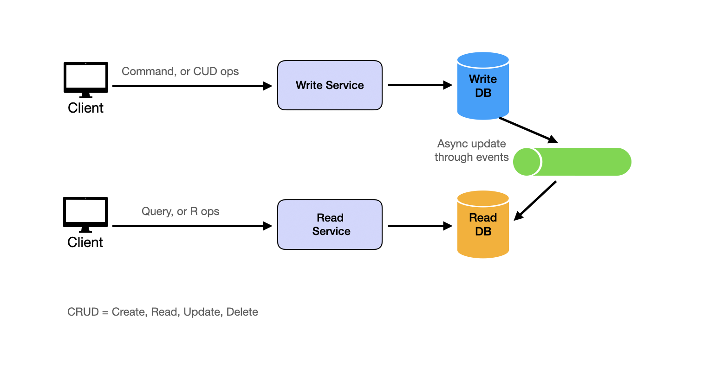
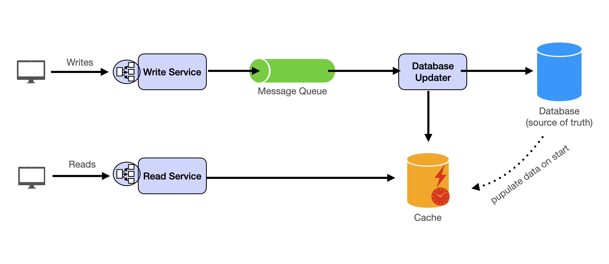

# System Design
## Tutorials
- [System Design Interview](https://bytebytego.com/courses/system-design-interview/foreword)
- [System Design Primer](http://systemdesignschool.io/primer)
- [System Design Course for Beginners](https://www.youtube.com/watch?v=MbjObHmDbZo)
- [System Design Interview – BIGGEST Mistakes to Avoid](https://www.youtube.com/watch?v=OvufRkoD-D0)
- [Back-Of-The-Envelope Estimation](https://www.youtube.com/watch?v=UC5xf8FbdJc)

- [Thinking Like an Architect - Gregor Hohpe](https://www.youtube.com/watch?v=xtxfrxf0mfE)

## Requirements of System
The system should be `scalable`, `reliable`, and `maintainable` which might involve into below criteria:
- Speed vs. Cost
- Consistency vs. Availability
- Flexibility vs. Simplicity

## **System Design Path & Template**
Reference:
- [Interview Step-by-Step](https://systemdesignschool.io/primer#interview-step-by-step)
- [Master System Design Interviews: 5 Key Questions & a Winning Template](https://www.youtube.com/watch?v=OWVaX_cBrh8)
1. **Design Functional Requirements**:

2. **Non-Functional Requirements**:
   - *Performance*: How fast `(latency)` does the system need to respond to user actions or process requests?
   - *Availability*: How consistently should the system be accessible `(SLI & SLO)` to users?
   - *Scalability*: Can the system handle increasing numbers of users, data, or traffic without a degradation in performance `(Scale Up & Scale Out)`?
   - *Reliability*: How well does the system handle failures `(Fault Tolerance)`?
   - *Consistency*: How accurately does the system reflect the same data across all users and operations `(Strong Consistency vs. Eventually Consistency)`?
   - *Durability*: How safely is data stored?
   - *Security*: How well does the system `protect against unauthorized access or attacks`?
3. **API Design**
4. **High Level Design (e.g. Twitter System)**
- Functional Requirements: To start with the functional requirements, just take API endpoints and map the data flow with some services.
  - Start with **mapping each API endpoint to a dedicated service** to enforce separation of concerns
  - Try to **Combine services** which have similar functionalities to simplify the design
  - With multiple services, it's always a good rule of thumb to add in and **API Gateway**

  
- Non-Functional Requirements
  - **Scalability**:
  It’s the most straightforward component to address in most cases. To implement horizontal scaling, we will deploy multiple instances of each service, and in order to distributed traffic efficiently, it's necessary to deploy a **Load Balancer** which ensures incoming requests are even distributed across available service instances. It also performs health checks to monitor the status of each instance and reroutes traffic away from unhealthy instances, ensuring high availability.
  
    
  - **Performance**:
  As we start to scale to millions of users and billions of tweets, accessing the database for every feed request will start to become exponentially slow with our current system. It seems a bit redundant for users to write tweets to the database, and then for the feed to re-pull these from the database each time. For example of Twitter Service, the Feed Service could leverage a distributed caching system like `Redis` or `Memcached` to store the most recent tweets for each user:
    - *Feed Precomputation*:
      When a user posts a tweet, the Feed Service doesn’t just update the followers’ feeds in the database. It also pushes the new tweet to a cache, storing it as part of the precomputed feeds for the user’s followers.
    - *Hot Data Access*:
      Caches are ideal for storing "hot" data - data that is accessed frequently, such as the latest tweets for a user's feed.
    - *Reducing Database Load*:
      By offloading repeated reads to the cache, we reduce the load on the database.
    - *Cache Expiry and Consistency*:
      To ensure the cache stays fresh, we can set an expiry time for cached items or use an event-driven update model.
  
  - **Availability**:
  A message queue acts as a buffer between services, decoupling their dependencies (*no direct communication between services*) and ensuring that messages  are not lost,  even if one of the services experiences downtime. For example, when a user posts a tweet, the Tweet Service doesn’t directly communicate with the Feed Service. Instead, it places the tweet in a queue, which is then processed by a consumer and added to both the database and cache. The Feed Service, which processes tweets to update users' feeds, then reads from this cache. This way, even if the Tweet Service goes offline, the messages (tweets) are safely stored in the queue and processed by the consumers, and the Feed Service can still update the feeds of the user’s followers when they log in. By incorporating a message queue, we ensure eventual consistency and high availability even during partial system failures. This decoupling of services also helps out with scalability, as the queue can handle varying workloads and traffic spikes without overwhelming downstream services.
  

  - **Durability**:
  In a system that handles billions of users, ensuring that data is never lost is essential. This is where leading us to step further and use a distributed databases model. A distributed database is designed to **replicate** and store data automatically across multiple nodes in a cluster. Additionally, distributed databases provide built-in mechanisms for **point-in-time recovery** and **automated backups**.

## System Design Template

## Core/Common Design Challenges
- **Challenge 1: Too Many Concurrent Users**
  The most common and intuitive problem is that a single machine/database has a **RPS/QPS limit**.
  > The solution is `repetition`: repeating the same assets of the service and assign the users randomly to each replication. When the replicated assets are server logic, it’s called `Load Balancing`. When the replicated asserts are data, it’s usually called `Database Replicas`.
- **Challenge 2: Too Much Data to Move Around**
  The twin challenge of too many users is the issue of too much data. The data becomes 'big' when it's no longer possible to hold everything on one machine.
  > The solution is called `sharding`: partitioning the data by some logic. The sharding logic groups some data together.
  
- **Challenge 3: The System Should be Fast and Responsive**
  The response time should be less than 500ms. If it goes longer than 1 second, the user will have a poor experience. **Reading** is usually fast after we have replication. Read requests are usually implemented as a query to an *in-memory key-value dictionary* beside HTTP protocols. Therefore, for many simple apps, the latency is mostly `network round time`. **Writing** is where the challenge lies because most writing processes involve many data queries and updates.
  > The solution is `asynchrony`: the write request is returned immediately after the server receives its data and puts the data in a queue. In the meantime, the actual processing continues in the back end.
  
  - **Challenge 4: Inconsistent (outdated) States**
    This challenge is a result of solving Challenge 1 and Challenge 2. With data replication and asynchronous data update, the read requests can easily see inconsistent data.
  > The solution is more on the application level than on the system level. Because the outdated read resulted from `replication` and `asynchronous updates` will eventually disappear when the servers catch up. This is called eventual consistency.

## Designing for Scale
Scaling a system effectively is one of the most critical aspects of satisfying non-functional requirements in system design. Scalability, in particular, is often a top priority. Effective scaling usually requires a **multi-faceted approach** combining several techniques. This starts with `decomposition to break down monolithic services` for independent scaling. Then, `partitioning and caching` work together to distribute load efficiently while enhancing performance. `Read/write separation` ensures fast reads and reliable writes through `leader-replica setups`. Finally, business logic adjustments help design strategies that mitigate operational bottlenecks without compromising user experience.

- **Decomposition**
  The key principle is to divide the system into smaller, independent services based on specific business capabilities or requirements. Each microservice should focus on a single responsibility to enhance scalability and maintainability.
  
- **Vertical Scaling**
  The concept is straightforward: scale up by using more powerful machines.
- **Horizontal Scaling**
  Horizontal scaling focuses on scaling out by running **multiple identical instances** of **stateless** services. The stateless nature of these services enables seamless distribution of requests across instances using load balancers.
- **Partitioning**
  Partitioning involves **splitting requests and data into shards** and distributing them across services or databases. Many systems implement `consistent hashing` to ensure balanced partitioning.
- **Caching**
  Caching serves to improve query read performance by storing frequently accessed data in faster memory storage.
- **Buffer with Message Queues**
  High-concurrency scenarios often encounter write-intensive operations. Frequent database writes can overload the system due to disk I/O bottlenecks. Message queues can buffer write requests, changing synchronous operations into asynchronous ones.
- **Separating Read and Write**
  A system is `read-heavy` or `write-heavy` depends on the business requirements. Read and write separation typically involves two main strategies. First, replication implements a **leader-follower architecture** where writes occur on the leader, and **followers provide read replicas**.
  
  Second, the so-called **CQRS (Command Query Responsibility Segregation) pattern** takes read-write separation further by using completely different models for reading and writing data. In CQRS, the system is split into two parts:
    - *Command Side (write side)*: Handles all write operations (create, update, delete) using a data model optimized for writes 
    - *Query Side (read side)*: Handles all read operations using a denormalized data model optimized for reads 
  Changes from the command side are **asynchronously propagated to the query side**.
  
  
## Adapting to Changing Business Requirements
Adapting business requirements offers a practical way to handle large traffic loads. While not strictly a technical approach, understanding these strategies demonstrates valuable experience and critical thinking skills in an interview setting.

## Master Template
Reference: [Master System Design Interviews: 5 Key Questions & a Winning Template](https://www.youtube.com/watch?v=OWVaX_cBrh8)

### Component Breakdown
- **Stateless Services**: Scalable and stateless, these services can be expanded by adding new machines and integrating them through a load balancer.
  - `Write Service`: Receives client requests and forwards them to the message queue.
  - `Read Service`: Handles read requests from clients by accessing the cache.
- **Database**: Serves as cold storage and the source of truth
- **Message Queue**:A buffer between writer services and data storage.
  - `Producers`: Comprised of write services that send data changes to the queue.
  - `Consumers`: Involved in updating both the database and the cache.
  - `Database` Updater: Asynchronous workers update the database by retrieving jobs from the message queue.
  - `Cache Updater`: Asynchronous workers refresh the cache by fetching jobs from the message queue.
- **Cache**: Facilitates fast and efficient read operations.

### Dataflow path
- **Read path**: For modern large-scale applications with millions of daily users, we almost always read from cache instead of from the database directly. The database acts as a permanent storage solution. Asynchronous jobs frequently transfer data from the database to the cache.
- **Write path**: Write requests are pushed into a /fundamentals/message-queue, allowing backend workers to manage the writing process.
- **Message queue**: Message queue is essential to scaling out our system to handle write requests. The necessity of message queues arises from:
  - `Varying Processing Rates`: Producers and consumers handle data at different speeds, necessitating a buffer.
  - `Fault Tolerance`: They ensure the persistence of messages, preventing data loss during failures.

## **Resilient vs. Fault Tolerant**:
- References:
  - [Making microservices Fault Tolerant and Resilient](https://medium.com/@ritesh.panigrahi/making-microservices-fault-tolerant-and-resilient-a2920ae156e4)
  - [RESILIENCE VS. FAULT TOLERANCE](https://www.ufried.com/blog/resilience_vs_fault_tolerance/)

> Reliable system is always an available system.
> Availability can be maintained by redundancy, but system may not be reliable
- Fault Tolerance:
> The ability of a software system to maintain its functionality in the event of the failure within some of its components which is one of the strategy to achieve availability.
> e.g. Netflix using `Graceful Degradation` to provide personal recommendation
- Resilience:
> The ability of a software system to recover from failures and continue to function correctly which also a strategy to achieve availability.
> e.g. Circuit Breaker, Retry, Bulkhead, & Timeout patterns

## WebSocket
- [How Web Sockets work | System Design Interview Basics](https://www.youtube.com/watch?v=pnj3Jbho5Ck)
- [How Web Sockets work | Deep Dive](https://www.youtube.com/watch?v=G0_e02DdH7I)
- [A Beginner's Guide to WebSockets](https://www.youtube.com/watch?v=8ARodQ4Wlf4)

## [Database](Components/Database/Database.md#Database)

## [Security](Components/Security.md)

